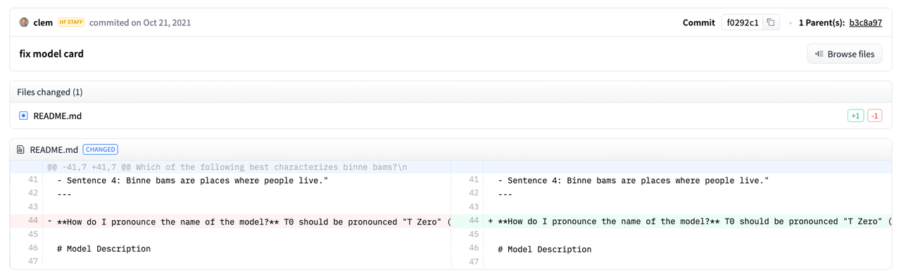
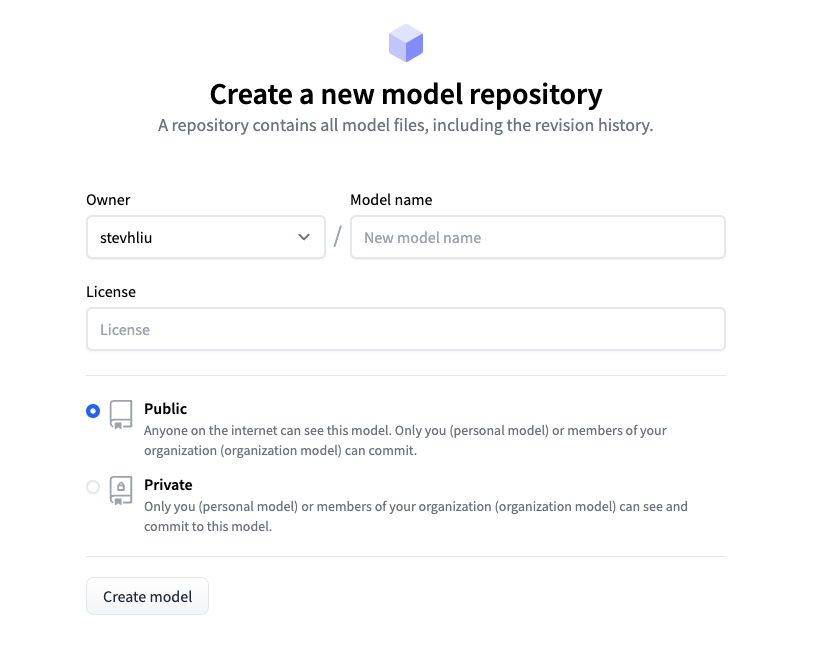
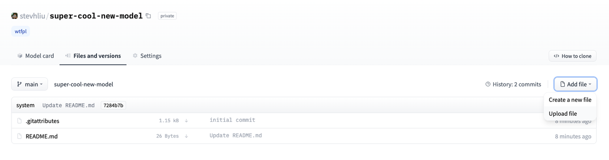

## **模型发布**

将您的模型发布到社区，在Hugging Face，我们相信公开分享知识和资源，能实现人工智能的普及化，让每个人都能受益。我们鼓励您将您的模型与社区分享，以帮助他人节省时间和精力。

在本教程中，您将学习两种在[Model Hub](https://huggingface.co/models)上共享训练好的或微调的模型的方法：

* 通过编程将文件推送到Hub。

* 使用Web界面将文件拖放到Hub。

要与社区共享模型，您需要在[huggingface.co](https://huggingface.co/join)上拥有一个帐户。您还可以加入现有的组织或创建一个新的组织。

## **仓库功能**

Model Hub上的每个仓库都像是一个典型的GitHub仓库。我们的仓库提供版本控制、提交历史记录以及可视化差异的能力。

Model Hub的内置版本控制基于git和[git-lfs](https://git-lfs.github.com/)。换句话说，您可以将一个模型视为一个仓库，从而实现更好的访问控制和可扩展性。版本控制允许使用*修订*方法来固定特定版本的模型，可以使用提交哈希值、标签或分支来标记。

因此，您可以通过`revision`参数加载特定的模型版本：

```txt
>>> model = AutoModel.from_pretrained(
...     "julien-c/EsperBERTo-small", revision="4c77982"  # tag name, or branch name, or commit hash
... )
```

文件也可以轻松地在仓库中编辑，您可以查看提交历史记录以及差异：&#x20;



## **设置**

在将模型共享到Hub之前，您需要拥有Hugging Face的凭证。如果您有访问终端的权限，请在安装🤗 Transformers的虚拟环境中运行以下命令。这将在您的Hugging Face缓存文件夹（默认为`~/.cache/`）中存储您的`access token`：

huggingface-cli login

如果您正在使用像Jupyter或Colaboratory这样的`notebook`，请确保您已安装了[huggingface\_hub](https://huggingface.co/docs/hub/adding-a-library)库。该库允许您以编程方式与Hub进行交互。

pip install huggingface\_hub

然后使用`notebook_login`登录到Hub，并按照[这里](https://huggingface.co/settings/token)的链接生成一个token进行登录：

```txt
>>> from huggingface_hub import notebook_login

>>> notebook_login()
```

## **转换模型适用于所有框架**

为确保您的模型可以被使用不同框架的人使用，我们建议您将PyTorch和TensorFlow `checkpoints`都转换并上传。如果您跳过此步骤，用户仍然可以从其他框架加载您的模型，但速度会变慢，因为🤗 Transformers需要实时转换`checkpoints`。

为另一个框架转换`checkpoints`很容易。确保您已安装PyTorch和TensorFlow（请参阅[此处](https://github.com/huggingface/transformers/blob/main/docs/source/zh/installation)的安装说明），然后在其他框架中找到适合您任务的特定模型。

指定`from_tf=True`将checkpoint从TensorFlow转换为PyTorch。

```txt
>>> pt_model = DistilBertForSequenceClassification.from_pretrained("path/to/awesome-name-you-picked", from_tf=True)
>>> pt_model.save_pretrained("path/to/awesome-name-you-picked")
```

指定`from_pt=True`将checkpoint从PyTorch转换为TensorFlow。

```python
>>> tf_model = TFDistilBertForSequenceClassification.from_pretrained("path/to/awesome-name-you-picked", from_pt=True)
```

然后，您可以使用新的checkpoint保存您的新TensorFlow模型：

```python
>>> tf_model.save_pretrained("path/to/awesome-name-you-picked")
```

如果模型在Flax中可用，您还可以将PyTorch checkpoint转换为Flax：

```txt
>>> flax_model = FlaxDistilBertForSequenceClassification.from_pretrained(
...     "path/to/awesome-name-you-picked", from_pt=True
... )
```

## **在训练过程中推送模型**

将模型分享到Hub就像添加一个额外的参数或回调函数一样简单。请记住，在[微调教程](https://github.com/huggingface/transformers/blob/main/docs/source/zh/training)中，`TrainingArguments`类是您指定超参数和附加训练选项的地方。其中一项训练选项包括直接将模型推送到Hub的能力。在您的`TrainingArguments`中设置`push_to_hub=True`：

```python
>>> training_args = TrainingArguments(output_dir="my-awesome-model", push_to_hub=True)
```

像往常一样将您的训练参数传递给\[`Trainer`]：

```txt
>>> trainer = Trainer(
...     model=model,
...     args=training_args,
...     train_dataset=small_train_dataset,
...     eval_dataset=small_eval_dataset,
...     compute_metrics=compute_metrics,
... )
```

在您微调完模型后，在\[`Trainer`]上调用\[`~transformers.Trainer.push_to_hub`]将训练好的模型推送到Hub。🤗 Transformers甚至会自动将训练超参数、训练结果和框架版本添加到你的模型卡片中！

```python
>>> trainer.push_to_hub()
```

使用\[`PushToHubCallback`]将模型分享到Hub。在\[`PushToHubCallback`]函数中，添加以下内容：

* 一个用于存储模型的输出目录。

* 一个tokenizer。

* hub\_model\_id，即您的Hub用户名和模型名称。

```txt
>>> from transformers import PushToHubCallback

>>> push_to_hub_callback = PushToHubCallback(
...     output_dir="./your_model_save_path", tokenizer=tokenizer, hub_model_id="your-username/my-awesome-model"
... )
```

将回调函数添加到 [fit](https://keras.io/api/models/model_training_apis/)中，然后🤗 Transformers 会将训练好的模型推送到 Hub：

```python
>>> model.fit(tf_train_dataset, validation_data=tf_validation_dataset, epochs=3, callbacks=push_to_hub_callback)
```

## **使用push\_to\_hub功能**

您可以直接在您的模型上调用push\_to\_hub来将其上传到Hub。

在`push_to_hub`中指定你的模型名称：

```python
>>> pt_model.push_to_hub("my-awesome-model")
```

这会在您的用户名下创建一个名为`my-awesome-model`的仓库。用户现在可以使用`from_pretrained`函数加载您的模型：

```txt
>>> from transformers import AutoModel

>>> model = AutoModel.from_pretrained("your_username/my-awesome-model")
```

如果您属于一个组织，并希望将您的模型推送到组织名称下，只需将其添加到`repo_id`中：

```python
>>> pt_model.push_to_hub("my-awesome-org/my-awesome-model")
```

`push_to_hub`函数还可以用于向模型仓库添加其他文件。例如，向模型仓库中添加一个`tokenizer`：

```python
>>> tokenizer.push_to_hub("my-awesome-model")
```

或者，您可能希望将您的微调后的PyTorch模型的TensorFlow版本添加进去：

```python
>>> tf_model.push_to_hub("my-awesome-model")
```

现在，当您导航到您的Hugging Face个人资料时，您应该看到您新创建的模型仓库。点击**文件**选项卡将显示您已上传到仓库的所有文件。

有关如何创建和上传文件到仓库的更多详细信息，请参考Hub文档[这里](https://huggingface.co/docs/hub/how-to-upstream)。

## **使用Web界面上传**

喜欢无代码方法的用户可以通过Hugging Face的Web界面上传模型。访问[huggingface.co/new](https://huggingface.co/new)创建一个新的仓库：



从这里开始，添加一些关于您的模型的信息：

* 选择仓库的**所有者**。这可以是您本人或者您所属的任何组织。

* 为您的项目选择一个名称，该名称也将成为仓库的名称。

* 选择您的模型是公开还是私有。

* 指定您的模型的许可证使用情况。

现在点击**文件**选项卡，然后点击**添加文件**按钮将一个新文件上传到你的仓库。接着拖放一个文件进行上传，并添加提交信息。



## **添加模型卡片**

为了确保用户了解您的模型的能力、限制、潜在偏差和伦理考虑，请在仓库中添加一个模型卡片。模型卡片在`README.md`文件中定义。你可以通过以下方式添加模型卡片：

* 手动创建并上传一个`README.md`文件。

* 在你的模型仓库中点击**编辑模型卡片**按钮。

可以参考DistilBert的[模型卡片](https://huggingface.co/distilbert/distilbert-base-uncased)来了解模型卡片应该包含的信息类型。有关您可以在`README.md`文件中控制的更多选项的细节，例如模型的碳足迹或小部件示例，请参考文档[这里](https://huggingface.co/docs/hub/models-cards)。
