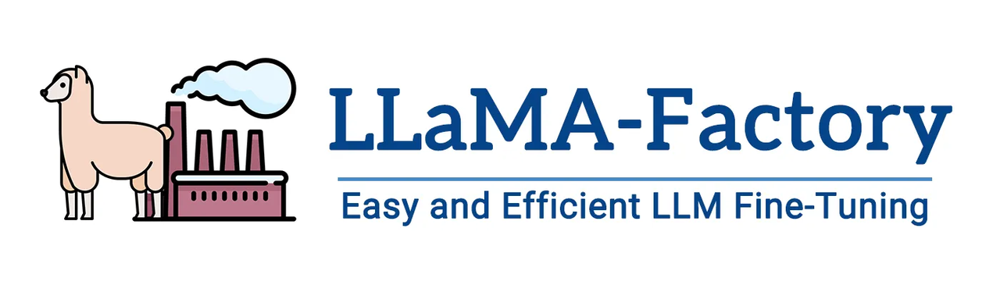
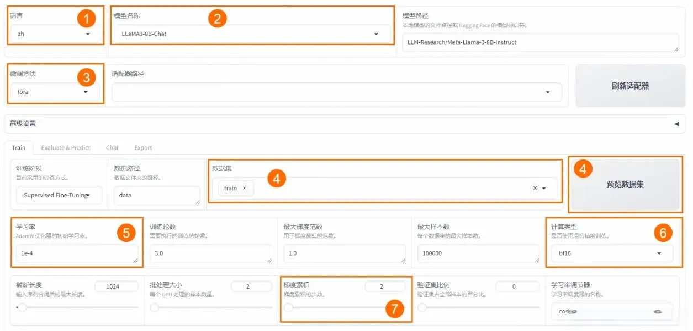
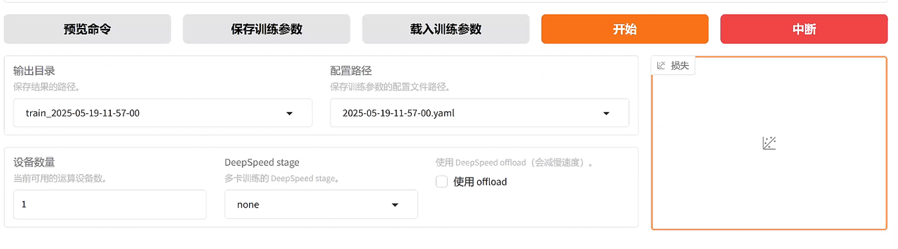
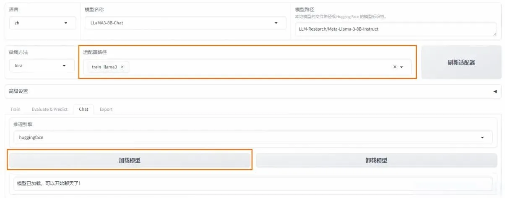
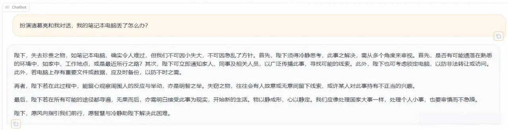
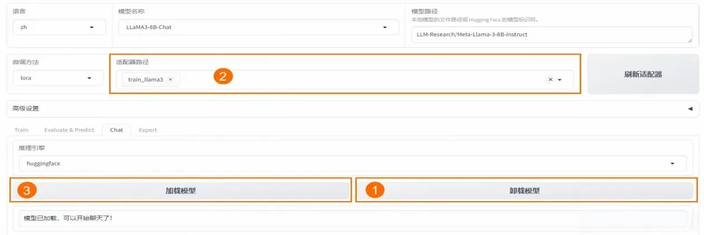

## 引言

随着[人工智能](https://so.csdn.net/so/search?q=%E4%BA%BA%E5%B7%A5%E6%99%BA%E8%83%BD\&spm=1001.2101.3001.7020)技术的飞速发展，大型语言模型（LLM）在自然语言处理（NLP）领域扮演着越来越重要的角色。然而，预训练的模型往往需要针对特定任务进行微调，以提高其在特定领域的性能。LLaMA-Factory 作为一个高效、易用的微调工具，为广大开发者提供了极大的便利。本次将详细介绍如何使用 LLaMA-Factory 从零开始微调大模型，帮助大家快速掌握这一技术。

## 一、模型微调讲解

### 1、什么是模型微调？

在深度学习领域，模型微调通常指的是在预训练模型的基础上进行的进一步训练。预训练模型是在大量数据上训练得到的，它已经学习到了语言的基本规律和丰富的特征表示。然而，这些模型可能并不直接适用于特定的任务或领域，因为它们可能缺乏对特定领域知识的理解和适应性。

模型微调通过在特定任务的数据集上继续训练预训练模型来进行，使得模型能够学习到与任务相关的特定特征和知识。这个过程通常涉及到模型权重的微幅调整，而不是从头开始训练一个全新的模型。

### 2、微调的过程

微调过程主要包括以下几个步骤：&#x20;

1. 数据准备：收集和准备特定任务的数据集。&#x20;

2. 模型选择：选择一个预训练模型作为基础模型。&#x20;

3) 迁移学习：在新数据集上继续训练模型，同时保留预训练模型的知识。&#x20;

4) 参数调整：根据需要调整模型的参数，如学习率、批大小等。&#x20;

5. 模型评估：在验证集上评估模型的性能，并根据反馈进行调整。

### 3、微调的优势

微调技术带来了多方面的优势：资源效率：相比于从头开始训练模型，微调可以显著减少所需的数据量和计算资源。快速部署：微调可以快速适应新任务，加速模型的部署过程。性能提升：针对特定任务的微调可以提高模型的准确性和鲁棒性。领域适应性：微调可以帮助模型更好地理解和适应特定领域的语言特点。

通过微调，可以使得预训练模型在这些任务上取得更好的性能，更好地满足实际应用的需求。

## 二、LLaMA-Factory 讲解

LLaMA-Factory 是一个开源的模型微调框架，致力于简化大型[语言模型](https://so.csdn.net/so/search?q=%E8%AF%AD%E8%A8%80%E6%A8%A1%E5%9E%8B\&spm=1001.2101.3001.7020)的定制过程。它集成了多种训练策略和监控工具，提供了命令行和 WebUI 等多种交互方式，大幅降低了模型微调的技术门槛。!

### 1、核心功能

* 多模型兼容：支持包括 LLama、Mistral、Falcon 在内的多种大型语言模型。

* 训练方法多样：涵盖全参数微调及 LoRA 等先进的微调技术。

* 用户界面友好：LLama Board 提供了一个直观的 Web 界面，使用户能够轻松调整模型设置。

* 监控工具集成：与 TensorBoard 等工具集成，便于监控和分析训练过程。

### 2、LLaMA-Factory 特点

* 易用性：简化了机器学习算法的复杂性，通过图形界面即可控制模型微调。

* 微调效率：支持 DPO、ORPO、PPO 和 SFT 等技术，提升了模型微调的效率和效果。

* 参数调整灵活性：用户可根据需求轻松调整模型参数，如 dropout 率、epochs 等。

* 多语言支持：界面支持英语、俄语和中文，面向全球用户提供服务。

### 3、使用场景

LLaMA-Factory 适用于广泛的 NLP 任务，包括但不限于：

* 文本分类：实现情感分析、主题识别等功能。

* 序列标注：如 NER、词性标注等任务。

* 文本生成：自动生成文本摘要、对话等。

* 机器翻译：优化特定语言对的翻译质量。

LLaMA-Factory 通过其强大的功能和易用性，助力用户在[自然语言处理](https://so.csdn.net/so/search?q=%E8%87%AA%E7%84%B6%E8%AF%AD%E8%A8%80%E5%A4%84%E7%90%86\&spm=1001.2101.3001.7020)领域快速实现模型的定制和优化。

## 三、安装 LLaMA Factory

在本章节中，我们将指导您如何安装和设置 LLaMA Factory，一个用于微调大型语言模型的工具。请按照以下步骤操作，以确保您能够顺利地使用 LLaMA Factory。

### 1、准备工作

首先，确保您的开发环境中已经安装了 Python3.9 或更高版本。这可以通过 Python 的官方网站下载安装，或者使用包管理器进行安装。1）显卡选择24 GB 显存的 A10：建议使用至少这个规格的实例，或者更高规格的实例以满足可能更大的计算需求。2）镜像选择：PyTorch 深度学习框架版本为 2.1.2。Python 3.10、CUDA 11.2（cu121），CUDA 是 NVIDIA 提供的用于通用并行计算的编程模型和 API。、Ubuntu 22.04 LTS（长期支持版本）操作系统。

### 2、获取 LLaMA-Factory

打开您的终端或命令行界面，然后执行以下命令来克隆 LLaMA-Factory 的代码仓库到本地：

这将创建一个名为`LLaMA-Factory`的文件夹，包含所有必要的代码和文件。

### 3、安装依赖

在安装 LLaMA-Factory 之前，您需要确保安装了所有必要的依赖。进入克隆的仓库目录，然后执行以下命令来安装依赖：

这个命令将安装 LLaMA-Factory 及其所有必需的附加组件，用于模型的评估和分析。

### 4、卸载可能冲突的包

如果在安装过程中与其他库发生冲突，您可能需要先卸载这些库。例如，如果`vllm`库与 LLaMA-Factory 不兼容，可以使用以下命令卸载：

### 5、LLaMA-Factory 版本检查

安装完成后，您可以通过运行以下命令来检查 LLaMA-Factory 是否正确安装以及其版本号：

如果安装成功，您将看到类似以下的输出，显示 LLaMA Factory 的版本信息：

### 6、验证安装

为了确保 LLaMA Factory 能够正常工作，您可以运行一些基本的命令来测试其功能。例如，尝试运行 LLaMA Factory 提供的一些示例脚本，或者使用其命令行界面来查看帮助信息：

这将列出所有可用的命令和选项，帮助您了解如何使用 LLaMA Factory。

注意事项

* 确保您的网络连接稳定，以便顺利下载代码仓库和安装依赖。

* 如果在安装过程中遇到问题，可以参考 LLaMA Factory 的官方文档或在社区中寻求帮助。

* 在安装过程中，您可能需要根据您的系统环境和配置调整上述命令。

通过遵循上述步骤，您将能够成功安装并开始使用 LLaMA Factory 进行大型语言模型的微调。在接下来的章节中，我们将深入探讨如何使用 LLaMA Factory 进行模型微调的具体操作。

## 四、数据集准备

LLaMA-Factory 提供了对多种数据集格式的支持，以适应不同类型的训练需求。本节将指导您如何准备和使用数据集进行模型微调。

### 1、使用内置数据集

LLaMA-Factory 项目在`data`目录下内置了丰富的数据集，您可以直接使用这些数据集进行模型训练和测试。如果您不需要自定义数据集，可以跳过数据集准备步骤。

### 2、自定义数据集准备

若需使用自定义数据集，您需要按照 LLaMA-Factory 支持的格式处理数据，并将其放置在`data`目录下。同时，您还需要修改`dataset_info.json`文件，以确保数据集被正确识别和加载。

#### 2.1 下载示例数据集

以下是使用示例数据集的步骤，假设您使用的是 PAI 提供的多轮对话数据集：

#### 2.2 查看数据集结构

数据集通常包含多轮对话样本，每轮对话由用户指令和模型回答组成。微调过程中，模型将学习这些样本的回答风格，以适应特定的语言风格或角色扮演需求。例如，数据集中的一个样本可能如下所示：

## 五、模型微调

### 1、启动 Web UI

使用以下命令启动 LLaMA-Factory 的 Web UI 界面，以便进行交互式模型微调：

这将启动一个本地 Web 服务器，您可以通过访问`http://0.0.0.0:7860`来使用 Web UI。请注意，这是一个内网地址，只能在当前实例内部访问。

### 2、配置参数

在 Web UI 中，您需要配置以下关键参数以进行模型微调：语言：选择模型支持的语言，例如`zh`。模型名称：选择要微调的模型，例如`LLaMA3-8B-Chat`。微调方法：选择微调技术，如`lora`。数据集：选择用于训练的数据集。学习率：设置模型训练的学习率。计算类型：根据 GPU 类型选择计算精度，如`bf16`或`fp16`。梯度累计：设置梯度累计的批次数。LoRA + 学习率比例：设置 LoRA + 的相对学习率。LoRA 作用模块：选择 LoRA 层挂载的模型部分。!

#### 训练指标

##### loss（损失）

&#x20;   \- \*\*含义\*\*：损失值是一个衡量模型预测与实际标签之间差异的指标。损失值越小，表示模型的预测结果越接近真实值。

&#x20;   \- \*\*例子\*\*：假设我们在训练一个猫狗分类器，损失值为0.7493表示模型在当前训练状态下，预测结果与实际标签之间的差异程度。损失值越小，说明模型的预测越准确。

##### grad（梯度）

**什么是梯度？**

&#x20;   1\. \*\*定义\*\*：

&#x20;       \* 梯度是一个向量，表示函数在某一点的方向导数。它指示了函数在该点上升最快的方向。

&#x20;       \* 在数学上，梯度是一个多元函数的偏导数的集合。

&#x20;   2\. \*\*在神经网络中的作用\*\*：

&#x20;       \* 在神经网络中，梯度用于更新模型的参数（如权重和偏置），以最小化损失函数。

&#x20;       \* 损失函数是一个衡量模型预测与真实标签之间差异的函数。通过最小化损失函数，模型的预测能力得以提高。

**梯度下降法**

&#x20;   1\. \*\*基本原理\*\*：

&#x20;       \* 梯度下降法是一种优化算法，用于通过迭代更新模型参数来最小化损失函数。

&#x20;       \* 在每次迭代中，计算损失函数相对于每个参数的梯度，然后沿着梯度的反方向更新参数。

&#x20;   2\. \*\*更新公式\*\*：

&#x20;       \* 参数更新的公式为：`θ = θ - α * ∇L(θ)`

&#x20;       \* 其中，`θ`是参数，`α`是学习率，`∇L(θ)`是损失函数关于参数的梯度。

&#x20;   3\. \*\*学习率\*\*：

&#x20;       \* 学习率是一个超参数，决定了每次更新的步长。

&#x20;       \* 学习率过大可能导致训练不稳定，学习率过小则可能导致收敛速度慢。

**在代码中的体现**

在你的代码中，梯度的计算和应用主要体现在以下部分：

&#x20;   \- `loss.backward()`：计算损失函数相对于模型参数的梯度。

&#x20;   \- `torch.nn.utils.clip_grad_norm_()`：对梯度进行裁剪，防止梯度爆炸。

&#x20;   \- `optimizer.step()`：根据计算出的梯度更新模型参数。

&#x20;   \- `optimizer.zero_grad()`：清空梯度缓存，以免影响下一次迭代。

通过这些步骤，模型的参数在每次迭代中逐渐调整，以最小化损失函数，从而提高模型的性能。

##### grad\_norm（梯度范数）

&#x20;   \- \*\*含义\*\*：梯度范数是一个衡量模型参数更新幅度的指标。它反映了模型在当前训练步骤中，参数调整的大小。过大的梯度可能导致训练不稳定。

&#x20;   \- \*\*例子\*\*：在训练过程中，如果grad\_norm为31.5907，说明模型参数在这一轮训练中调整的幅度较大。通常，我们希望梯度范数适中，以确保模型稳定收敛。

##### learning\_rate（学习率）：

&#x20;   \- \*\*含义\*\*：学习率是一个超参数，决定了模型在每次更新时，参数调整的步长。学习率过大可能导致模型不收敛，过小则可能导致训练速度过慢。

&#x20;   \- \*\*例子\*\*：学习率为1.354e-05表示每次参数更新时，模型的调整步长非常小。这通常用于精细调整模型参数，以提高模型的精度。

##### epoch（轮次）

&#x20;   \- \*\*含义\*\*：一个epoch表示模型已经完整地遍历了一遍训练数据集。通常，训练需要多个epoch以确保模型充分学习数据特征。

&#x20;   \- \*\*例子\*\*：epoch为0.73表示模型已经完成了73%的第一轮训练。通常，我们会设置多轮训练以提高模型的性能。

这些参数帮助我们监控和调整模型的训练过程，以便获得更好的预测性能。

### 3、开始微调

在 Web UI 中设置好参数后，您可以开始模型微调过程。微调完成后，您可以在界面上观察到训练进度和损失曲线。!

1）将输出目录修改为 train\_llama3，训练后的 LoRA 权重将会保存在此目录中。

2）单击 “预览” 命令，可展示所有已配置的参数。如果您希望通过代码进行微调，可以复制这段命令，在命令行运行。

3）单击 “开始”，启动模型微调。启动微调后需要等待大约 20 分钟，待模型下载完毕后，可在界面观察到训练进度和损失曲线。当显示训练完毕时，代表模型微调成功。!

## 六、对话测试

在 Web UI 的 Chat 页签下，加载微调后的模型进行对话测试。您可以输入文本与模型进行交互，并观察模型的回答是否符合预期。!

在页面底部的对话框输入想要和模型对话的内容，单击提交，即可发送消息。发送后模型会逐字生成回答，从回答中可以发现模型学习到了数据集中的内容，能够恰当地模仿目标角色的语气进行对话。!

单击卸载模型，单击取消适配器路径，然后单击加载模型，即可与微调前的原始模型聊天。!

