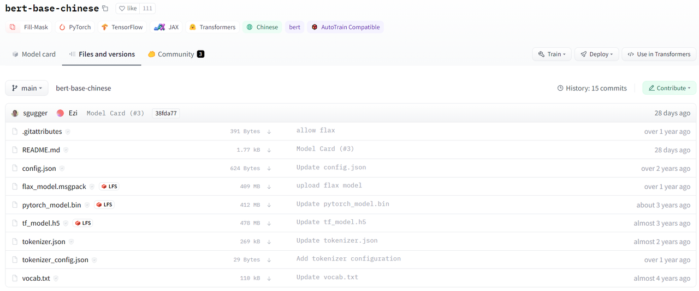

现在做 NLP 方面的研究实在离不开预训练语言模型，尤其是 BERT。

huggingface 的 transformers 包是目前使用 BERT 最主流最方便的工具之一

注：由于官方文档和网页时常更新，链接失效是很有可能的！

本次使用的 transformers 版本为 4.15.0

1. 预训练模型下载


`huggingface/transformers` 支持的所有模型：<https://huggingface.co/models>


如果环境支持科学上网，可以通过`git lfs`命令直接下载模型。

```txt
git lfs install
git clone https://huggingface.co/bert-base-chinese
```


如果需要手动下载模型并上传至服务器，则可以在 huggingface 的网页中手动下载模型。


通常我们需要保存的是三个文件及一些额外的文件


* 配置文件 config.json

* 词典文件 vocab.json

* 预训练模型文件，如果你使用 pytorch 则保存 pytorch\_model.bin，如果你使用 tensorflow 2 则保存 tf\_model.h5


额外的文件，指的是 merges.txt、special\_tokens\_map.json、added\_tokens.json、tokenizer\_config.json、sentencepiece.bpe.[model](https://so.csdn.net/so/search?q=model\&spm=1001.2101.3001.7020) 等，这几类是 tokenizer 需要使用的文件，如果出现的话，也需要保存下来。没有的话，就不必在意。如果不确定哪些需要下，哪些不需要的话，可以把类似的文件全部下载下来。


以 [bert-base-chinese](https://huggingface.co/bert-base-chinese) 模型为例，点击 Files and versions，下载所需的文件，放入与模型同名的文件夹中。




**下载后，需保持文件夹和文件名称与仓库中的一致。**

**模型的快速使用**

```txt
from transformers import AutoTokenizer, AutoModelForMaskedLM
tokenizer = AutoTokenizer.from_pretrained("bert-base-chinese")
model = AutoModelForMaskedLM.from_pretrained("bert-base-chinese")
```

`from_pretrained()`的参数`pretrained_model_name_or_path`，可以接受的参数有如下几种：


* short-cut name（缩写名称，类似于 gpt2 这种）

* identifier name（类似于 microsoft/DialoGPT-small 这种）

* 文件夹

* 文件


对于 short-cut name 或 identifier name，这种情况下，本地有文件，可以使用本地的，本地没有文件，则会自动下载。


一些常用的 short-cut name，可以在 <https://huggingface.co/models> 中查看


对于文件夹，则会从文件夹中找 vocab.json、pytorch\_model.bin、tf\_model.h5、merges.txt、special\_tokens\_map.json、added\_tokens.json、tokenizer\_config.json、sentencepiece.bpe.model 等进行加载。所以这也是为什么下载的时候，一定要保证这些名称是这几个，不能变。


对于文件，则会直接加载文件。


官方给的样例，通常都是 short-cut name，我们可以将之替换为下载好的模型文件夹路径。


```txt
from transformers import AutoTokenizer, AutoModelForMaskedLM
tokenizer = AutoTokenizer.from_pretrained(local_model_path)
model = AutoModelForMaskedLM.from_pretrained(local_model_path)
```


官方 Quick tour


[Quick tour 代码实时运行（google Colab）](https://colab.research.google.com/github/huggingface/notebooks/blob/main/transformers_doc/en/pytorch/quicktour.ipynb)


### 1. pipeline API

在给定任务上使用预训练模型的最简单方法是使用`pipeline()`。Transformers 为以下任务提供了开箱即用的接口：


* 情感分析（Sentiment analysis）

* 英语文本生成（Text generation in English）

* 命令实体识别（Name entity recognition, NER）

* QA

* 文本填空: 给定带有被屏蔽词的文本（例如，用 \[mask] 替换），然后填入空白处

* 摘要（Summarization）

* 翻译

* 特征提取: 返回文本的向量表示


[所有任务的示例代码](https://huggingface.co/docs/transformers/v4.15.0/en/task_summary)


下面以情感分析任务为例


```txt
from transformers import pipeline
classifier = pipeline('sentiment-analysis')
```


第一次键入此命令时，将下载对应的预训练模型和它的分词器（[tokenizer](https://so.csdn.net/so/search?q=tokenizer\&spm=1001.2101.3001.7020)）。分词器的作用是将文本先进行预处理，然后将分词结果输入模型进行预测。管道将所有这些信息组合在一起，并对预测进行后期处理，使其可读。


简单使用：


```txt
classifier('We are very happy to show you the 🤗 Transformers library.')
```


也可以输入句子的 list，返回的结果将是一个字典列表。


```txt
results = classifier(["We are very happy to show you the 🤗 Transformers library.",
           "We hope you don't hate it."])
for result in results:
    print(f"label: {result['label']}, with score: {round(result['score'], 4)}")
# label: POSITIVE, with score: 0.9998
# label: NEGATIVE, with score: 0.5309
```


默认这个 pipeline 下载的模型是 “distilbert-base-uncased-finetuned-sst-2-english”，我们可以在 huggingface 的网站中找到更多用于文本分类的 BERT 模型，地址为 <https://huggingface.co/models?pipeline_tag=text-classification>


选择使用模型的代码如下：


```txt
classifier = pipeline('sentiment-analysis', model="techthiyanes/chinese_sentiment")
```


我们也可以使用保存在本地的预训练模型。我们需要向 pipeline 中传递一个模型对象和其相应的分词器。


我们将需要两个类来完成这个工作。


第一个是 AutoTokenizer，我们将使用它下载与我们选择的模型关联的分词器，并对它进行实例化。


第二个是 AutoModelForSequenceClassification，我们将使用它来下载模型本身。


```txt
from transformers import AutoTokenizer, AutoModelForSequenceClassification
model_name = "nlptown/bert-base-multilingual-uncased-sentiment"
model = AutoModelForSequenceClassification.from_pretrained(model_name)
tokenizer = AutoTokenizer.from_pretrained(model_name)
classifier = pipeline('sentiment-analysis', model=model, tokenizer=tokenizer)
```


请注意，如果我们在其他任务中使用该库，则模型的类将发生更改。详情见 [Summary of the tasks](https://huggingface.co/transformers/v4.6.0/task_summary.html)


### 2. pipeline 的工作原理

如下面的代码所示，模型和分词器是通过`from_pretrained`方法创建的。


```txt
from transformers import AutoTokenizer, AutoModelForSequenceClassification
model_name = "distilbert-base-uncased-finetuned-sst-2-english"
pt_model = AutoModelForSequenceClassification.from_pretrained(model_name)
tokenizer = AutoTokenizer.from_pretrained(model_name)
```


#### 2.1 使用分词器（tokenizer）

第一步，tokenizer 会将输入文本分成单词（或单词的一部分，标点符号等），通常称为标记（token）。因为存在不同的预处理方式，所以我们在实例化 tokenizer 的时候，需要传入预训练模型的模型名称。


第二步，将 tokens 转换为数字，从而把输入文本转化成 tensor 的形式，输入对应的模型中。tokenizer 中有一个词表（vocab），在调用 from\_pretrained 方法时下载的，因为我们需要使用和模型在预训练阶段用的一样的词表。


为了实现上述的功能, 我们可以直接把文本传给 tokenizer。返回一个字典，包含的是 [input\_ids](https://huggingface.co/transformers/v4.6.0/glossary.html#input-ids)，还有 [attention mask](https://huggingface.co/transformers/glossary.html#attention-mask)"input\_ids" 是输入的 tokens 在词表中的 id，"attention\_mask" 告诉模型哪些词需要关注，哪些词不需要关注。


```txt
inputs = tokenizer("We are very happy to show you the 🤗 Transformers library.")
print(inputs)
```


```txt
{
    'input_ids':[101, 2057, 2024, 2200, 3407, 2000, 2265, 2017, 1996, 100, 19081, 3075, 1012, 102],                  'attention_mask': [1, 1, 1, 1, 1, 1, 1, 1, 1, 1, 1, 1, 1, 1]
}
```


设置 tokenizer 的参数，比如将输入文本全部填充到相同的长度，将它们们截断到模型可接受的最大长度，然后返回张量。


```txt
pt_batch = tokenizer(
    ["We are very happy to show you the 🤗 Transformers library.", "We hope you don't hate it."],
    padding=True,
    truncation=True,
    max_length=512,
    return_tensors="pt"
)
for key, value in pt_batch.items():
    print(f"{key}: {value.numpy().tolist()}")

# input_ids: [[101, 2057, 2024, 2200, 3407, 2000, 2265, 2017, 1996, 100, 19081, 3075, 1012, 102], [101, 2057, 3246, 2017, 2123, 1005, 1056, 5223, 2009, 1012, 102, 0, 0, 0]]
# attention_mask: [[1, 1, 1, 1, 1, 1, 1, 1, 1, 1, 1, 1, 1, 1], [1, 1, 1, 1, 1, 1, 1, 1, 1, 1, 1, 0, 0, 0]]
```


注意 padding 出来的地方，attention\_mask 为 0。


对于填充的部分，也会生成对应的 attention mask，但值为 0，因为填充部分不需要模型进行关注。更多关于 tokenizer 见[文档](https://huggingface.co/transformers/v4.6.0/preprocessing.html)


#### 2.2 使用模型（model）

一旦 tokenizer 处理好了对应的文本，我们就可以直接把处理好的结果传给对应的模型。


```txt
pt_outputs = pt_model(**pt_batch)
print(pt_outputs)
SequenceClassifierOutput(loss=None, logits=tensor([[-4.0833,  4.3364],
    [ 0.0818, -0.0418]], grad_fn=<AddmmBackward>), hidden_states=None, attentions=None)
```


**输出的 logits 是什么？**


形式：torch.FloatTensor of shape (batch\_size, config.num\_labels))


意义：Classification (or regression if config.num\_labels==1) scores (before SoftMax)


全部的 Transformers models（PyTorch 或 TensorFlow）返回模型在最终激活函数（如 SoftMax）之前的激活，因为该最终激活功能通常与损失函数混淆。


在最后的结果中使用 softmax 函数来获得最终的预测


```txt
from torch import nn
pt_predictions = nn.functional.softmax(pt_outputs.logits, dim=-1)
print(pt_predictions)

tensor([[2.2043e-04, 9.9978e-01],
        [5.3086e-01, 4.6914e-01]], grad_fn=<SoftmaxBackward>)
```


如果除了输入之外，还为模型提供标签，则模型输出对象还将包含损失属性：


```txt
import torch
pt_outputs = pt_model(**pt_batch, labels = torch.tensor([1, 0]))
print(pt_outputs)
```


```txt
SequenceClassifierOutput(loss=tensor(0.3167, grad_fn=<NllLossBackward>), logits=tensor([[-4.0833,  4.3364],
        [ 0.0818, -0.0418]], grad_fn=<AddmmBackward>), hidden_states=None, attentions=None)
```


训练完成后，保存模型


```txt
pt_save_directory = './pt_save_pretrained'
tokenizer.save_pretrained(pt_save_directory)
pt_model.save_pretrained(pt_save_directory)
```


也可以这样载入模型，即不使用 AutoModel 和 AutoTokenizer。transformers 库中每个架构加类的组合有一个模型类，因此如果需要，代码很容易访问和调整。


```txt
from transformers import DistilBertTokenizer, DistilBertForSequenceClassification
model_name = "distilbert-base-uncased-finetuned-sst-2-english"
model = DistilBertForSequenceClassification.from_pretrained(model_name)
tokenizer = DistilBertTokenizer.from_pretrained(model_name)
```


#### 2.3 定制模型参数

如果要更改模型本身的构建方式，可以定义自定义配置类。每个体系结构都有自己的相关配置。例如，DistilBertConfig 允许您为 DistilBERT 指定隐藏层维度、dropout rate 等参数。如果您进行核心修改，例如更改隐藏层大小（hidden size），您将无法再使用预训练模型，需要从头开始训练。然后，您将直接从此配置实例化模型。


下面，我们使用`from_pretrained()`方法加载 tokenizer 的预定义词汇表。然而，我们希望从头开始初始化模型。因此，我们从配置实例化模型，而不是使用`from_pretrained()`方法。


```txt
from transformers import DistilBertConfig, DistilBertTokenizer, DistilBertForSequenceClassification
config = DistilBertConfig(n_heads=8, dim=512, hidden_dim=4*512)
tokenizer = DistilBertTokenizer.from_pretrained('distilbert-base-uncased')
model = DistilBertForSequenceClassification(config)
```


对于仅更改模型头部（例如，标签数量）的对象，仍然可以对主体使用预训练模型。


例如，让我们使用预训练体为 10 个不同的标签定义一个分类器。我们可以将配置需要的任何参数传递给 from\_pretrained() 方法，它将适当地更新默认配置，而不是创建一个具有所有默认值的新配置来更改标签的数量：


```txt
from transformers import DistilBertConfig, DistilBertTokenizer, DistilBertForSequenceClassification
model_name = "distilbert-base-uncased"
model = DistilBertForSequenceClassification.from_pretrained(model_name, num_labels=10)
tokenizer = DistilBertTokenizer.from_pretrained(model_name)
```


