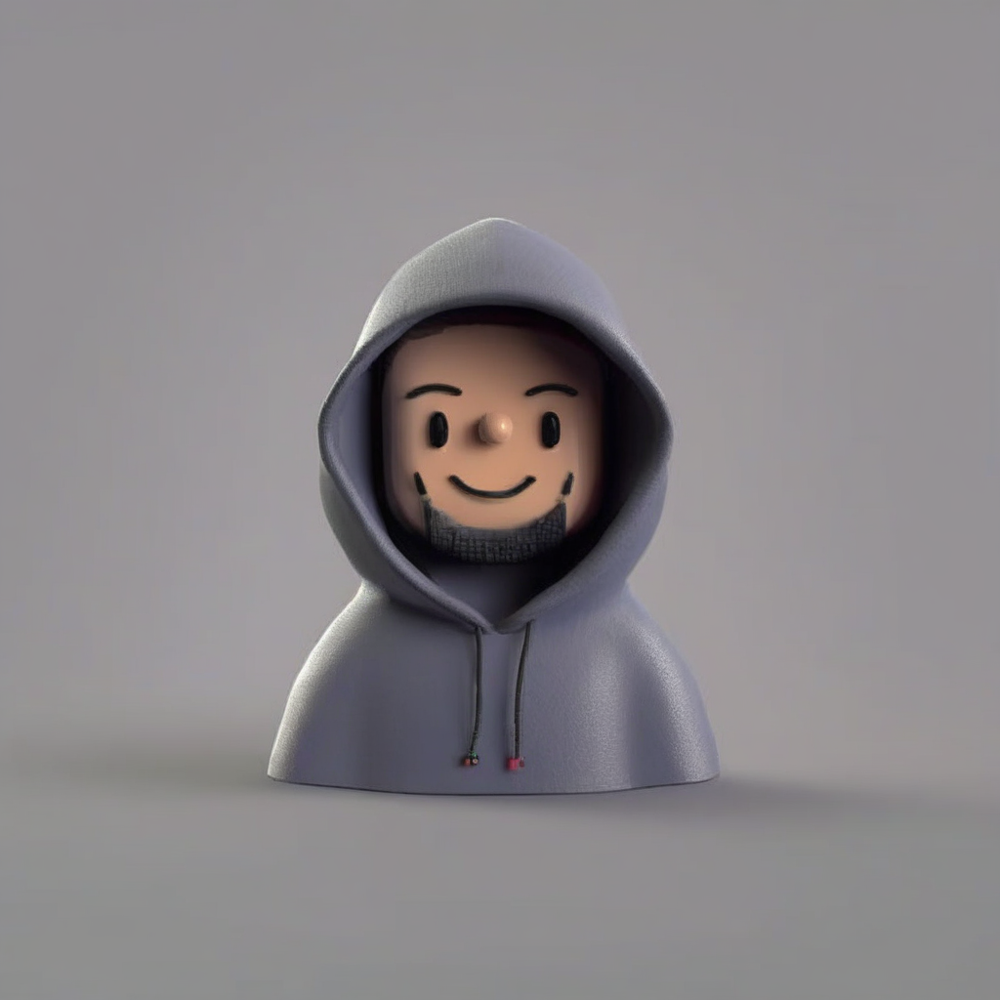
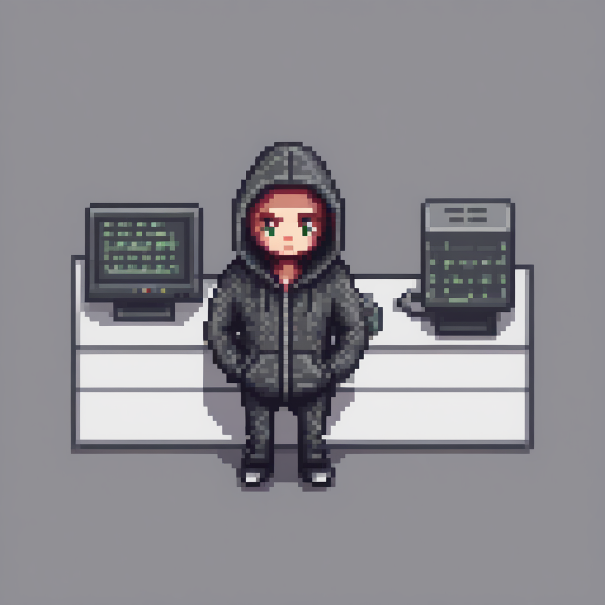
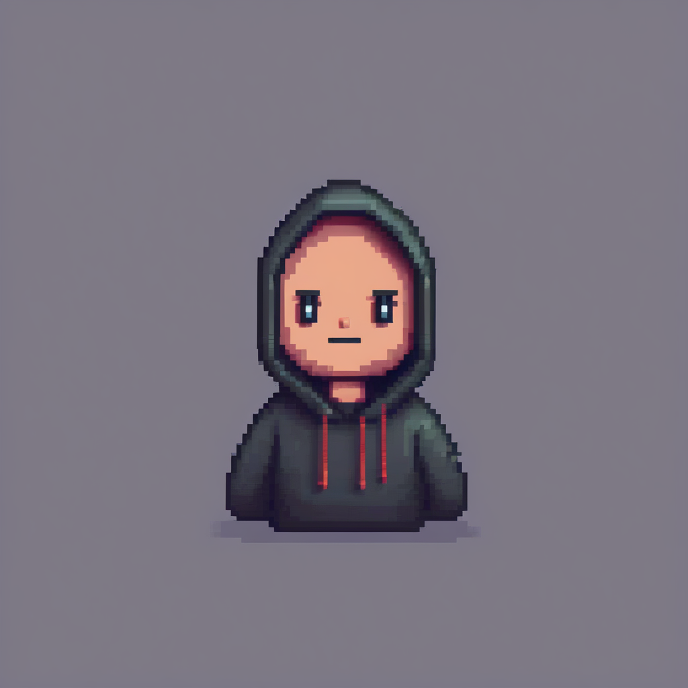
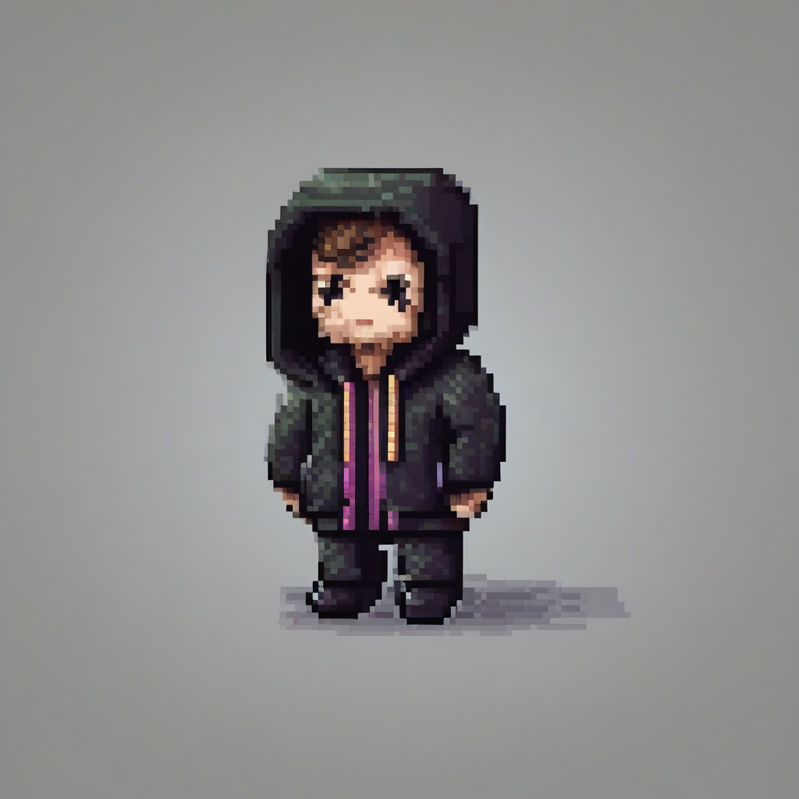
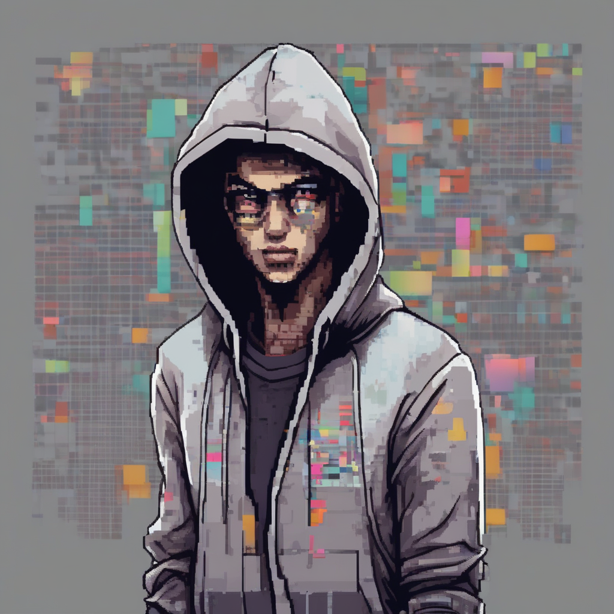
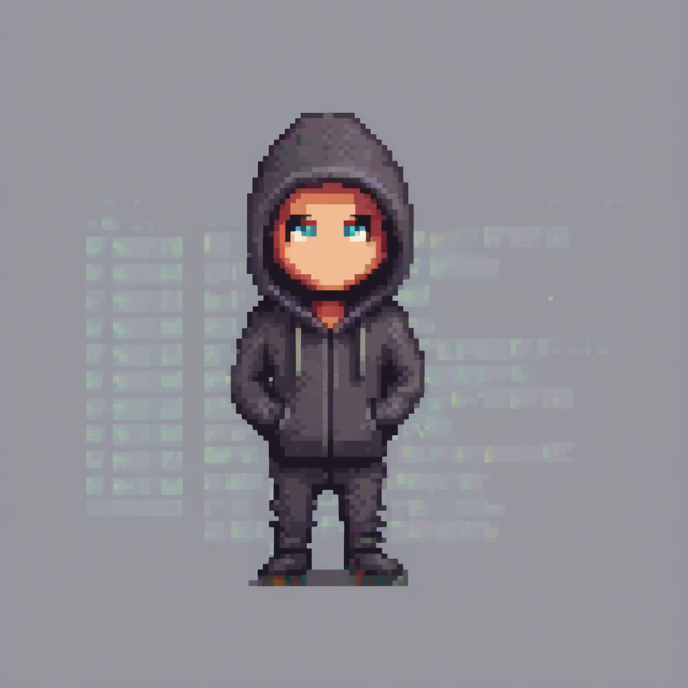
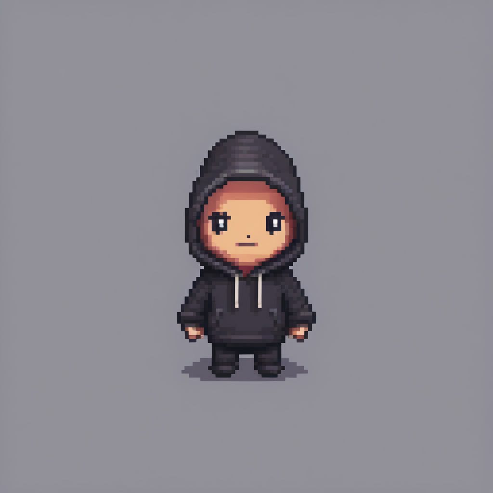

#

# 前言

PEFT 的实际优势扩展到了其他 Hugging Face 库，例如 [Diffusers](https://hugging-face.cn/docs/diffusers) 和 [Transformers](https://hugging-face.cn/docs/transformers)。PEFT 的主要优势之一是，PEFT 方法生成的适配器文件比原始模型小得多，这使得管理和使用多个适配器变得非常容易。您可以使用一个预训练的基础模型来处理多个任务，只需加载为要解决的任务微调的新适配器即可。或者，您可以将多个适配器与文本到图像扩散模型结合使用，以创建新的效果。

本教程将向您展示 PEFT 如何帮助您管理 Diffusers 和 Transformers 中的适配器。

## Diffusers

Diffusers 是一个生成式 AI 库，用于使用扩散模型从文本或图像创建图像和视频。LoRA 是一种特别流行的扩散模型训练方法，因为您可以非常快速地训练和共享扩散模型，以生成新风格的图像。为了更轻松地使用和尝试多个 LoRA 模型，Diffusers 使用 PEFT 库来帮助管理用于推理的不同适配器。

例如，加载一个基础模型，然后加载 [artificialguybr/3DRedmond-V1](https://hugging-face.cn/artificialguybr/3DRedmond-V1) 适配器，以便使用 [load\_lora\_weights](https://hugging-face.cn/docs/diffusers/v0.24.0/en/api/loaders/lora#diffusers.loaders.LoraLoaderMixin.load_lora_weights) 方法进行推理。加载方法中的 `adapter_name` 参数由 PEFT 启用，允许您为适配器设置名称，以便更容易引用它。

```python
import torch
from diffusers import DiffusionPipeline

pipeline = DiffusionPipeline.from_pretrained(
    "stabilityai/stable-diffusion-xl-base-1.0", torch_dtype=torch.float16
).to("cuda")
pipeline.load_lora_weights(
    "peft-internal-testing/artificialguybr__3DRedmond-V1",
    weight_name="3DRedmond-3DRenderStyle-3DRenderAF.safetensors",
    adapter_name="3d"
)
image = pipeline("sushi rolls shaped like kawaii cat faces").images[0]
image
```


现在让我们尝试另一个很酷的 LoRA 模型，[ostris/super-cereal-sdxl-lora](https://hugging-face.cn/ostris/super-cereal-sdxl-lora)。您只需使用 `adapter_name` 加载并命名这个新适配器，然后使用 [set\_adapters](https://hugging-face.cn/docs/diffusers/api/loaders/unet#diffusers.loaders.UNet2DConditionLoadersMixin.set_adapters) 方法将其设置为当前活动的适配器。

```python
pipeline.load_lora_weights(
    "ostris/super-cereal-sdxl-lora",
    weight_name="cereal_box_sdxl_v1.safetensors",
    adapter_name="cereal"
)
pipeline.set_adapters("cereal")
image = pipeline("sushi rolls shaped like kawaii cat faces").images[0]
image
```

最后，您可以调用 [disable\_lora](https://hugging-face.cn/docs/diffusers/api/loaders/unet#diffusers.loaders.UNet2DConditionLoadersMixin.disable_lora) 方法来恢复基础模型。

`pipeline.disable_lora()`

要了解有关 PEFT 如何支持 Diffusers 的更多信息，请参阅 [使用 PEFT 进行推理](https://hugging-face.cn/docs/diffusers/tutorials/using_peft_for_inference) 教程。


# 加载用于推理的 LoRA

有许多 adapter 类型（其中 [LoRA](https://hugging-face.cn/docs/peft/conceptual_guides/adapter#low-rank-adaptation-lora) 最受欢迎），它们以不同风格进行训练以实现不同的效果。您甚至可以组合多个 adapter 以创建新的和独特的图像。

在本教程中，您将学习如何通过 🤗 Diffusers 中的 🤗 [PEFT](https://hugging-face.cn/docs/peft/index) 集成，轻松加载和管理用于推理的 adapters。您将使用 LoRA 作为主要的 adapter 技术，因此您会看到术语 LoRA 和 adapter 交替使用。

让我们首先安装所有必需的库。

`!pip install -q transformers accelerate peft diffusers`

现在，加载一个带有 [Stable Diffusion XL (SDXL)](https://hugging-face.cn/docs/diffusers/api/pipelines/stable_diffusion/stable_diffusion_xl) 检查点的 pipeline

```python
from diffusers import DiffusionPipeline
import torch

pipe_id = "stabilityai/stable-diffusion-xl-base-1.0"
pipe = DiffusionPipeline.from_pretrained(pipe_id, torch_dtype=torch.float16).to("cuda")
```

接下来，使用 [load\_lora\_weights()](https://hugging-face.cn/docs/diffusers/v0.32.2/en/api/loaders/lora#diffusers.loaders.StableDiffusionXLLoraLoaderMixin.load_lora_weights) 方法加载 [CiroN2022/toy-face](https://hugging-face.cn/CiroN2022/toy-face) adapter。 通过 🤗 PEFT 集成，您可以为检查点分配一个特定的 `adapter_name`，这使您可以轻松地在不同的 LoRA 检查点之间切换。 让我们将此 adapter 称为 `"toy"`。

`pipe.load_lora_weights("CiroN2022/toy-face", weight_name="toy_face_sdxl.safetensors", adapter_name="toy")`

确保在 prompt 中包含 token `toy_face`，然后您可以执行推理

```python
prompt = "toy_face of a hacker with a hoodie"

lora_scale = 0.9
image = pipe(
    prompt, num_inference_steps=30, cross_attention_kwargs={"scale": lora_scale}, generator=torch.manual_seed(0)
).images[0]
image
```



使用 `adapter_name` 参数，使用另一个 adapter 进行推理非常容易！ 加载已微调以生成像素艺术图像的 [nerijs/pixel-art-xl](https://hugging-face.cn/nerijs/pixel-art-xl) adapter，并将其称为 `"pixel"`。

Pipeline 会自动将第一个加载的 adapter (`"toy"`) 设置为活动 adapter，但您可以使用 `~PeftAdapterMixin.set_adapters` 方法激活 `"pixel"` adapter

`pipe.load_lora_weights("nerijs/pixel-art-xl", weight_name="pixel-art-xl.safetensors", adapter_name="pixel")`

`pipe.set_adapters("pixel")`

确保在您的 prompt 中包含 token `pixel art` 以生成像素艺术图像

```python
prompt = "a hacker with a hoodie, pixel art"
image = pipe(
    prompt, num_inference_steps=30, cross_attention_kwargs={"scale": lora_scale}, generator=torch.manual_seed(0)
).images[0]
image
```



默认情况下，如果检测到最新版本的 PEFT 和 Transformers，则 `low_cpu_mem_usage` 将设置为 `True`，以加快 LoRA 检查点的加载时间。

## 合并 adapters

您还可以合并不同的 adapter 检查点以进行推理，从而将它们的风格融合在一起。

再次，使用 `~PeftAdapterMixin.set_adapters` 方法激活 `pixel` 和 `toy` adapters，并指定它们应该如何合并的权重。

`pipe.set_adapters(["pixel", "toy"], adapter_weights=[0.5, 1.0])`

扩散社区中的 LoRA 检查点几乎总是通过 [DreamBooth](https://hugging-face.cn/docs/diffusers/main/en/training/dreambooth) 获得。 DreamBooth 训练通常依赖于输入文本 prompt 中的“触发”词，以便生成结果看起来符合预期。 当您组合多个 LoRA 检查点时，重要的是确保输入文本 prompt 中存在相应 LoRA 检查点的触发词。

请记住在 prompt 中使用 [CiroN2022/toy-face](https://hugging-face.cn/CiroN2022/toy-face) 和 [nerijs/pixel-art-xl](https://hugging-face.cn/nerijs/pixel-art-xl) 的触发词（这些可以在它们的仓库中找到）来生成图像。

```python
prompt = "toy_face of a hacker with a hoodie, pixel art"
image = pipe(
    prompt, num_inference_steps=30, cross_attention_kwargs={"scale": 1.0}, generator=torch.manual_seed(0)
).images[0]
image
```



令人印象深刻！ 正如您所看到的，该模型生成了一张混合了两个 adapter 特征的图像。

通过其 PEFT 集成，Diffusers 还提供了更高效的合并方法，您可以在 [Merge LoRAs](https://hugging-face.cn/docs/diffusers/using-diffusers/merge_loras) 指南中了解更多信息！

要返回仅使用一个 adapter，请使用 `~PeftAdapterMixin.set_adapters` 方法激活 `"toy"` adapter

```python
pipe.set_adapters("toy")

prompt = "toy_face of a hacker with a hoodie"
lora_scale = 0.9
image = pipe(
    prompt, num_inference_steps=30, cross_attention_kwargs={"scale": lora_scale}, generator=torch.manual_seed(0)
).images[0]
image
```

或者要完全禁用所有 adapters，请使用 `~PeftAdapterMixin.disable_lora` 方法返回基础模型。

```python
pipe.disable_lora()

prompt = "toy_face of a hacker with a hoodie"
image = pipe(prompt, num_inference_steps=30, generator=torch.manual_seed(0)).images[0]
image
```


### 自定义 adapters 强度

为了获得更多自定义选项，您可以控制 adapter 对 pipeline 每个部分的影响强度。 为此，请将包含控制强度（称为“scales”）的字典传递给 `~PeftAdapterMixin.set_adapters`。

例如，以下是如何为 `down` 部分启用 adapter，但为 `mid` 和 `up` 部分禁用它的方法

```python
pipe.enable_lora()  # enable lora again, after we disabled it above
prompt = "toy_face of a hacker with a hoodie, pixel art"
adapter_weight_scales = { "unet": { "down": 1, "mid": 0, "up": 0} }
pipe.set_adapters("pixel", adapter_weight_scales)
image = pipe(prompt, num_inference_steps=30, generator=torch.manual_seed(0)).images[0]
image
```



让我们看看分别关闭 `down` 部分并打开 `mid` 和 `up` 部分如何改变图像。

```python
adapter_weight_scales = { "unet": { "down": 0, "mid": 1, "up": 0} }
pipe.set_adapters("pixel", adapter_weight_scales)
image = pipe(prompt, num_inference_steps=30, generator=torch.manual_seed(0)).images[0]
image
```



```python
adapter_weight_scales = { "unet": { "down": 0, "mid": 0, "up": 1} }
pipe.set_adapters("pixel", adapter_weight_scales)
image = pipe(prompt, num_inference_steps=30, generator=torch.manual_seed(0)).images[0]
image
```



看起来很酷！

这是一个非常强大的功能。 您可以使用它来控制 adapter 强度，甚至可以细化到每个 transformer 级别。 而且您甚至可以将其用于多个 adapters。

```python
adapter_weight_scales_toy = 0.5
adapter_weight_scales_pixel = {
    "unet": {
        "down": 0.9,  # all transformers in the down-part will use scale 0.9
        # "mid"  # because, in this example, "mid" is not given, all transformers in the mid part will use the default scale 1.0
        "up": {
            "block_0": 0.6,  # all 3 transformers in the 0th block in the up-part will use scale 0.6
            "block_1": [0.4, 0.8, 1.0],  # the 3 transformers in the 1st block in the up-part will use scales 0.4, 0.8 and 1.0 respectively
        }
    }
}
pipe.set_adapters(["toy", "pixel"], [adapter_weight_scales_toy, adapter_weight_scales_pixel])
image = pipe(prompt, num_inference_steps=30, generator=torch.manual_seed(0)).images[0]
image
```



## 管理 adapters

在本教程中，您已经附加了多个 adapters，如果您对哪些 adapters 已附加到 pipeline 的组件感到困惑，请使用 [get\_active\_adapters()](https://hugging-face.cn/docs/diffusers/v0.32.2/en/api/loaders/lora#diffusers.loaders.lora_base.LoraBaseMixin.get_active_adapters) 方法来检查活动 adapters 的列表

```java
active_adapters = pipe.get_active_adapters()
active_adapters
["toy", "pixel"]
您还可以使用 get_list_adapters() 获取每个 pipeline 组件的活动 adapters
list_adapters_component_wise = pipe.get_list_adapters()
list_adapters_component_wise
{"text_encoder": ["toy", "pixel"], "unet": ["toy", "pixel"], "text_encoder_2": ["toy", "pixel"]}
~PeftAdapterMixin.delete_adapters 函数会从模型中完全删除 adapter 及其 LoRA 层。
pipe.delete_adapters("toy")
pipe.get_active_adapters()
["pixel"]
```

#

