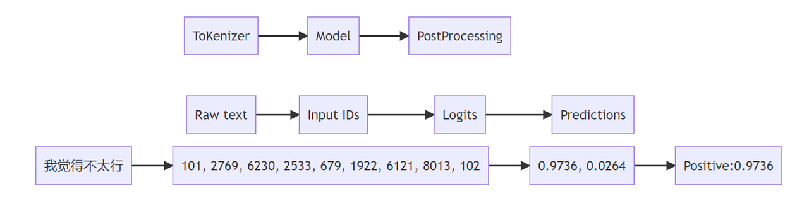
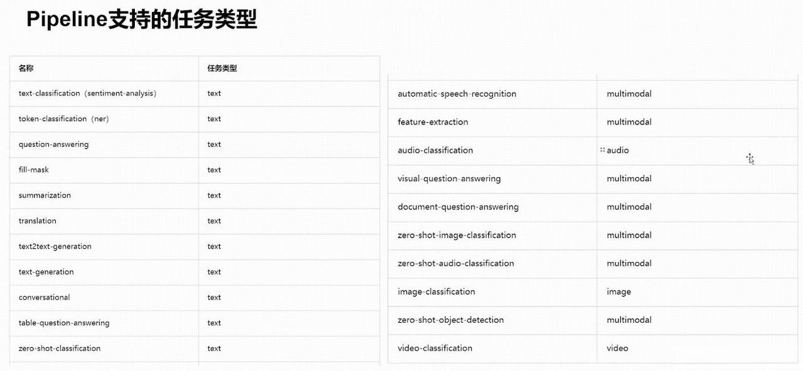

## 一、Transformers 分类推理过程

* 将数据预处理、模型调用、结果后处理三部分组装成的流水线，如下流程图

* 使我们能够直接输入文本便获得最终的答案，不需要我们关注细节



## 二、查看 PipeLine 支持的任务类型

```python
from transformers.pipelines import SUPPORTED_TASKS
from pprint import pprint
for k, v in SUPPORTED_TASKS.items():
    print(k, v)
```

输出但其概念 PipeLine 支持的任务类型以及可以调用的举例输出：

```python
audio-classification {'impl': <class 'transformers.pipelines.audio_classification.AudioClassificationPipeline'>, 'tf': (), 'pt': (<class 'transformers.models.auto.modeling_auto.AutoModelForAudioClassification'>,), 'default': {'model': {'pt': ('superb/wav2vec2-base-superb-ks', '372e048')}}, 'type': 'audio'}
automatic-speech-recognition 
text-to-audio 
feature-extraction
text-classification
```

* key: 任务的名称，如音频分类

* v：关于任务的实现，如具体哪个 Pipeline，有没有 TF 模型，有没有 pytorch 模型， 模型具体是哪一个



## 三、Pipeline 的创建和使用

### 3.1 根据任务类型，直接创建 Pipeline，默认是英文模型

```python
from transformers import pipeline
pipe = pipeline("text-classification") # 根据pipeline直接创建一个任务类
pipe("very good") # 测试一个句子，输出结果
```

### 3.2 指定任务类型，再指定模型，创建基于指定模型的 Pipeline

注，这里我已经将模型离线下载到本地了

```python
# https://huggingface.co/models
pipe = pipeline("text-classification", model="./models/roberta-base-finetuned-dianping-chinese")
```

### 3.3 预先加载模型，再创建 Pipeline

```python
from transformers import AutoModelForSequenceClassification, AutoTokenizer

# 这种方式，必须同时指定model和tokenizer
model = AutoModelForSequenceClassification.from_pretrained("./models_roberta-base-finetuned-dianping-chinese")
tokenizer = AutoTokenizer.from_pretrained("./models_roberta-base-finetuned-dianping-chinese")
pipe = pipeline("text-classification", model=model, tokenizer=tokenizer)
```

### 3.4 使用 Gpu 进行推理

`pipe = pipeline("text-classification", model="./models_roberta-base-finetuned-dianping-chinese", device=0)`

### 3.5 查看 Device

`pipe.model.device`

### `3.6 测试一下耗时`

```sql
import torch
import time
times = []
for i in range(100):
    torch.cuda.synchronize()
    start = time.time()
    pipe("我觉得不太行！")
    torch.cuda.synchronize()
    end = time.time()
    times.append(end - start)
print(sum(times) / 100)
```

### 3.7 确定的 Pipeline 的参数

```python
# 先创建一个pipeline
qa_pipe = pipeline("question-answering", model="../../models/models")
qa_pipe
#<transformers.pipelines.question_answering.QuestionAnsweringPipeline object at 0x0000025E1C2E1190>
```

输出`QuestionAnsweringPipeline`

查看定义，会告诉我们这个 pipeline 该如何使用

````python
class QuestionAnsweringPipeline(ChunkPipeline):
    """
    Question Answering pipeline using any ModelForQuestionAnswering. See the [question answering](../task_summary#question-answering)[
](../task_summary#question-answering)[    examples](../task_summary#question-answering) for more information.

    Example:

    ```python
    >>> from transformers import pipeline

    >>> oracle = pipeline(model="deepset/roberta-base-squad2")
    >>> oracle(question="Where do I live?", context="My name is Wolfgang and I live in Berlin")
    {'score': 0.9191, 'start': 34, 'end': 40, 'answer': 'Berlin'}
````

```sql
Learn more about the basics of using a pipeline in the [pipeline tutorial](../pipeline_tutorial)

This question answering pipeline can currently be loaded from [pipeline] using the following task identifier:
"question-answering".

The models that this pipeline can use are models that have been fine-tuned on a question answering task. See the
up-to-date list of available models on
huggingface.co/models.

```

进入 pipeline，看`call`，查看可以支持的更多的参数 &#x20;

列出了更多的参数

```python
def __call__(self, *args, **kwargs):
    """
    Answer the question(s) given as inputs by using the context(s).

    Args:
        args ([SquadExample] or a list of [SquadExample]):
            One or several [SquadExample] containing the question and context.
        X ([SquadExample] or a list of [SquadExample], *optional*):
            One or several [SquadExample] containing the question and context (will be treated the same way as if
            passed as the first positional argument).
        data ([SquadExample] or a list of [SquadExample], *optional*):
            One or several [SquadExample] containing the question and context (will be treated the same way as if
            passed as the first positional argument).
        question (str or List[str]):
            One or several question(s) (must be used in conjunction with the context argument).
        context (str or List[str]):
            One or several context(s) associated with the question(s) (must be used in conjunction with the
            question argument).
        topk (int, *optional*, defaults to 1):
            The number of answers to return (will be chosen by order of likelihood). Note that we return less than
            topk answers if there are not enough options available within the context.
        doc_stride (int, *optional*, defaults to 128):
            If the context is too long to fit with the question for the model, it will be split in several chunks
            with some overlap. This argument controls the size of that overlap.
        max_answer_len (int, *optional*, defaults to 15):
            The maximum length of predicted answers (e.g., only answers with a shorter length are considered).
        max_seq_len (int, *optional*, defaults to 384):
            The maximum length of the total sentence (context + question) in tokens of each chunk passed to the
            model. The context will be split in several chunks (using doc_stride as overlap) if needed.
        max_question_len (int, *optional*, defaults to 64):
            The maximum length of the question after tokenization. It will be truncated if needed.
        handle_impossible_answer (bool, *optional*, defaults to False):
            Whether or not we accept impossible as an answer.
        align_to_words (bool, *optional*, defaults to True):
            Attempts to align the answer to real words. Improves quality on space separated langages. Might hurt on
            non-space-separated languages (like Japanese or Chinese)

    Return:
        A dict or a list of dict: Each result comes as a dictionary with the following keys:

        - score (float) -- The probability associated to the answer.
        - start (int) -- The character start index of the answer (in the tokenized version of the input).
        - end (int) -- The character end index of the answer (in the tokenized version of the input).
        - answer (str) -- The answer to the question.
    """
```

如下面的例子

我们输出问题：中国的首都是哪里？ 给的上下文是：中国的首都是北京

```sql
qa_pipe(question="中国的首都是哪里？", context="中国的首都是北京")

#{'score': 0.013524415902793407, 'start': 5, 'end': 6, 'answer': '是'}
```

如果通过 max\_answer\_len 参数来限定输出的最大长度，会进行强行截断

```sql
qa_pipe(question="中国的首都是哪里？", context="中国的首都是北京", max_answer_len=1)
#{'score': 0.014148608781397343, 'start': 2, 'end': 3, 'answer': '的'}
```


## 四、Pipeline的背后实现

* step1 初始化组件，Tokenizer，model

```python
# step1 初始化tokenizer， model
tokenizer = AutoTokenizer.from_pretrained("../../models/models_roberta-base-finetuned-dianping-chinese")
model = AutoModelForSequenceClassification.from_pretrained("../../models/models_roberta-base-finetuned-dianping-chinese")
```


* step2 预处理

```python
# 预处理，返回pytorch的tensor，是一个dict
input_text = "我觉得不太行！"
inputs = tokenizer(input_text, return_tensors="pt")
inputs

#{'input_ids': tensor([[ 101, 2769, 6230, 2533,  679, 1922, 6121, 8013,  102]]), 'token_type_ids': tensor([[0, 0, 0, 0, 0, 0, 0, 0, 0]]), 'attention_mask': tensor([[1, 1, 1, 1, 1, 1, 1, 1, 1]])}
```

* step3 模型预测

```python
res = model(**inputs)
res

#SequenceClassifierOutput(loss=None, logits=tensor([[ 1.7376, -1.8681]], grad_fn=<AddmmBackward0>), hidden_states=None, attentions=None)
```

预测的结果，包括的内容有点多，如loss,logits等

* step4 结果后处理

```python
logits = res.logits
logits = torch.softmax(logits, dim=-1)
pred = torch.argmax(logits).item()
result = model.config.id2label.get(pred)
result

#negative (stars 1, 2 and 3)
```


