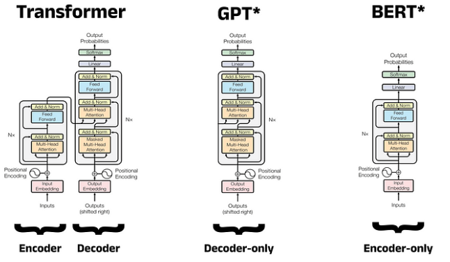
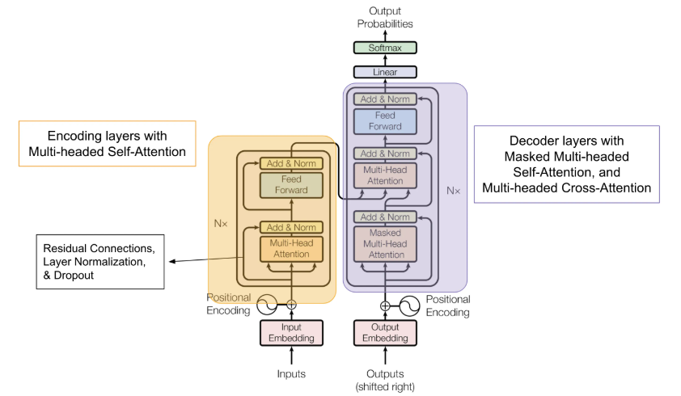
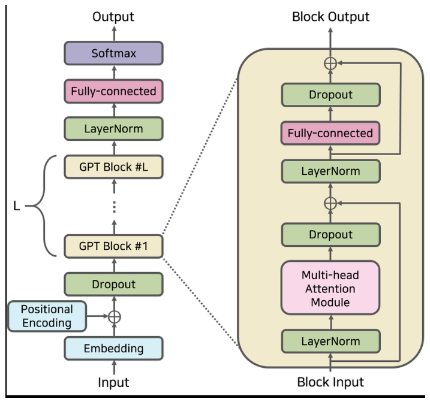
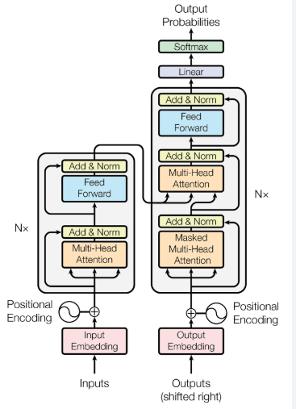
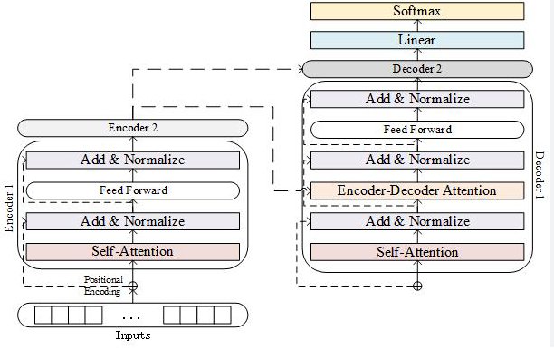

随着人工智能技术的飞速发展，大语言模型（Large Language Models, LLMs）在自然语言处理（NLP）领域扮演了越来越重要的角色。它们不仅在语义理解、文本生成方面取得了显著的成果，还推动了人机交互、内容创作等多种应用的变革。本次我们探讨下大语言模型的主流架构，帮助大家深入理解这些模型的工作机制。

### 1. 大语言模型的背景

在探讨具体架构之前，我们需要了解一下大语言模型的背景。大语言模型通常指的是基于深度学习技术的大规模预训练模型，这些模型通过大量文本数据进行训练，具备了丰富的语言知识和上下文理解能力。GPT（Generative Pre-trained Transformer）、BERT（Bidirectional Encoder Representations from Transformers）等都是广为人知的示例。

### 2. 主流架构

#### 2.1 Transformer 架构

Transformer 架构是大语言模型的核心基础之一，首次在 Vaswani 等人于 2017 年发布的论文《Attention is All You Need》中提出。与传统的循环神经网络（Recurrent Neural Networks, RNNs）相比，Transformer 采用了完全不同的机制，提供了更高的并行处理能力和更长的序列建模能力，因此迅速成为[自然语言处理](https://so.csdn.net/so/search?q=%E8%87%AA%E7%84%B6%E8%AF%AD%E8%A8%80%E5%A4%84%E7%90%86\&spm=1001.2101.3001.7020)（NLP）领域的主流架构。

##### 关键组成部分

Transformer 由多个关键组件构成，主要包括自注意力机制（Self-Attention）、前馈神经网络（Feed-Forward Neural Network）、位置编码（Positional Encoding）、层归一化（Layer Normalization）以及编码器 - 解码器（Encoder-Decoder）结构。

###### 1. 自注意力机制

自注意力机制是 Transformer 的核心，允许模型在处理某个词的时候，考虑序列中其他所有词的信息。该机制可以通过以下步骤实现：

* **输入向量转换**：每个输入词被映射成三个不同的向量：查询（Query）、键（Key）和值（Value）。

* **计算注意力得分**：查询向量与所有键向量进行点积，得到注意力得分。得分越高，表示该词对模型当前输出的重要性越大。

* **归一化处理**：使用 Softmax 函数对得分进行归一化，以形成注意力权重，确保所有权重和为一。

* **加权求和**：使用注意力权重对值向量进行加权求和，最终得到加权后的输出表示。

这一机制能够有效捕捉到单词之间的关联性，尤其在面对长文本时表现尤为出色。相比于 RNN，Transformer 不再依赖着时间序列的顺序处理，因而能够在更短的时间内并行计算，有效提升了训练效率。

###### 2. 前馈神经网络

在自注意力层之后，输出会传递给一个前馈神经网络。此网络由两层全连接层构成，通常在中间使用 ReLU 或 GELU 等激活函数进行非线性变换。前馈神经网络的主要功能是对自注意力的输出进行进一步加工，增加模型的表达能力。

###### 3. 位置编码

由于自注意力机制在计算时不依赖于输入序列的顺序，Transformer 需要一种方式来引入位置信息，从而确保模型能够理解词语在句子中的相对位置。为此，Transformer 使用了位置编码（Positional Encoding）。位置编码是将每个词的嵌入向量与一个表示该词位置的向量相加，从而调整各个词的表示，使其包含位置信息。Vaswani 等人提出了利用正余弦函数生成的位置编码，确保能够在各个维度上进行不同的位移。

###### 4. 层归一化

在自注意力层与前馈神经网络之间，以及前馈神经网络的输出后，都会应用层归一化（Layer Normalization）。层归一化通过对每层的输入进行标准化，帮助模型在训练时更加稳定，加速收敛，并提升模型的性能。

###### 5. 编码器 - 解码器结构

标准的 Transformer 结构包含一个编码器（Encoder）和一个解码器（Decoder）。编码器由多个相同的层堆叠而成，每个层都包括自注意力机制和前馈神经网络。而解码器同样由多个层堆叠而成，差别在于每层的解码器还引入了从编码器输出中提取的上下文信息，使得模型能够在生成阶段参考编码器中的信息。

**编码器的功能**：将输入的文本序列转换为一系列上下文相关的隐层表示。

**解码器的功能**：根据编码器的输出，以及之前生成的文本逐步生成目标序列。

#### 2.1.1 Transformer 的优点

Transformer 架构相较于传统的 RNN 具有以下几个显著优势：

* **并行处理**：由于自注意力机制不依赖于输入词的顺序，因此可以在训练时实现并行计算，显著提升速度。

* **长距离依赖**：Transformer 能够更好地处理长文本，因为自注意力机制可以直接连接输入序列中的任意两个词，捕获长距离依赖关系。

* **可扩展性**：Transformer 的结构设计使得它能够轻易地进行扩展和调整层数，适应不同规模和复杂度的任务。

总结来说，Transformer 架构是大语言模型成功的关键之一，凭借其自注意力机制、前馈网络、位置编码等创新设计，极大地提升了模型在文本处理中的能力。理解 Transformer 的结构与工作原理，对于深入研究和应用大语言模型具有重要意义。随着技术的进步，Transformer 架构也在持续演变，为下一代模型的发展奠定了基础。

#### 2.2 GPT 系列

GPT（Generative Pre-trained Transformer）系列模型是当今自然语言处理（NLP）领域最具影响力的大语言模型之一。由 OpenAI 于 2018 年首次发布的 GPT-1 开始，随后推出了 GPT-2、GPT-3，以及最新的 GPT-4。这些模型在文本生成、理解和各种 NLP 任务上都取得了显著的突破。下面，我们将深入探讨 GPT 系列的架构、训练过程、应用场景及其对 NLP 领域的影响。

##### 1. GPT 架构

GPT 系列的核心基于 Transformer 架构的解码器部分，这一设计使其特别适合于生成任务。与传统的 Transformer 不同，GPT 采用了单向自注意力机制。具体而言，模型在生成一个词时，仅会考虑这个词前面的上下文信息，而不会使用后面的信息，确保生成过程的顺序性。

###### 1.1 单向自注意力

单向自注意力机制通过只关注输入序列中当前词之前的词，从而有效构建一个条件概率分布，确保模型能够基于已有上下文生成下一个词。这种特性使得 GPT 在语言生成任务中表现出色，比如文本续写和问答系统。

###### 1.2 多层解码器

GPT 系列在具体实现上由多个解码器层堆叠而成。每个解码器层都由自注意力层和前馈神经网络组成，提供丰富的特征抽象能力。通过堆叠多个这样的层，GPT 能够学习到越来越复杂的语言结构和上下文关系。

###### 1.3 位置编码

与标准 Transformer 相同，GPT 也使用位置编码来引入词的位置信息。显式的位置信息使得模型能够理解词汇在句子中的具体位置，并充分考虑词序对句意的影响。

##### 2. 预训练与微调

GPT 系列采用了预训练 - 微调策略，这一策略使得模型在大规模的文本数据上进行无监督的预训练，然后针对具体任务进行有监督的微调。

###### 2.1 预训练阶段

在预训练阶段，GPT 系列模型通过大规模文本数据学习语言的基本结构和模式。模型的目标是最大化生成下一个词的概率。具体而言，在输入文本中，模型会根据前 n 个词预测第 n+1 个词。这种无监督学习使得模型在对话、叙述和各种语境中都能产生连贯的文本。

###### 2.2 微调阶段

完成预训练后，模型会在特定任务的数据集上进行微调。这一过程通常使用有标签的数据，旨在提升模型在特定 NLP 任务（如情感分析、摘要生成和机器翻译等）上的表现。微调的灵活性使得 GPT 模型能够适应多种场景，最终输出高质量的文本结果。

##### 3. 应用场景

GPT 系列模型在多个领域和应用场景中展现了其强大的能力。以下是一些主要的应用案例：

###### 3.1 文本生成

GPT models excel at text generation tasks, such as creative writing, story generation, and dialogue systems. They can take a prompt from the user and generate coherent and contextually relevant content, making them valuable tools for content creators and marketers.

###### 3.2 问答系统

通过精确把握上下文，GPT 模型能够实现高效的问答系统，支持用户咨询与回答的智能交互。这使得 GPT 在客户服务、在线教育及咨询领域中表现突出。

###### 3.3 翻译和摘要

通过文本的上下文理解，GPT 能够执行一定程度的翻译和摘要功能，虽然相较于专门的翻译模型仍有一定差距，但其多样性和灵活性使其适用于多个语言间的转换与信息提炼。

##### 4. 影响与展望

GPT 系列的推出，不仅推动了 NLP 研究的前沿，还在许多实际应用中引领了技术的潮流。它展示了预训练语言模型的潜力，促使研究者探索更深层次的学习策略，如 Few-shot 和 Zero-shot 学习，这些策略使得模型在几乎没有额外训练数据的情况下，也能展现出良好的学习能力。

随着 GPT 系列的不断演进，未来我们可以期待它在多模态学习、知识增强和更广泛的任务适应性方面取得进一步的成果。此外，模型的可控性和可信性也是未来研究的重要方向，以确保生成内容的可靠性和安全性。

GPT 系列模型凭借其基于 Transformer 的架构设计及其预训练 - 微调的策略，成为了自然语言处理领域的里程碑。了解 GPT 的架构和应用场景，不仅有助于我们把握当前的技术进展，也为未来的 NLP 研究和应用提供了广阔的视野。随着技术的不断发展，GPT 系列模型将继续在全球范围内产生深远的影响，推动着信息交互的方式与内容创作的未来。

#### 2.3 BERT 系列

BERT（Bidirectional Encoder Representations from Transformers）是由 Google 于 2018 年推出的一种深度学习模型，它在自然语言处理（NLP）领域引发了广泛关注和高度评价。BERT 相较于之前的模型具有显著的创新，尤其是在句子理解和上下文表示方面，通过双向训练的方式，BERT 可以同时考虑上下文信息的左右两侧，在许多自然语言处理任务上都取得了令人印象深刻的成果。下面，我们将对 BERT 的架构、训练过程和应用场景进行深入探讨，同时分析其对 NLP 领域的深远影响。

##### 1. BERT 架构

BERT 是基于 Transformer 架构的编码器部分，它的设计旨在解决传统语言模型对于上下文在线性推理的局限性。以下是 BERT 架构的几个关键组成部分：

###### 1.1 自注意力机制

BERT 使用了自注意力机制（Self-Attention），这种机制能够在处理输入文本时，关注各个词之间的关联性。在每次计算某个词的表示时，模型不仅考虑这个词前面的词，还考虑后面的词，从而生成一个更为丰富的上下文表示。具体来说，模型会将输入序列中所有词的表示向量通过自注意力层进行处理，得到每个词在上下文中的相对重要性。

###### 1.2 双向表示

BERT 的核心创新之一是其双向性。传统的语言模型（如 LSTM 和 RNN）通常是单向的，只能依赖之前的上下文来预测当前的词，而 BERT 通过同时考虑左侧和右侧的上下文，能更全面地理解句子结构和其语义。例如，在句子 “他去了银行” 中，BERT 能够理解 “银行” 的含义是在某个经济金融机构，而不是河岸，通过前后文的信息得出正确的语义。

###### 1.3 多层编码器

BERT 模型通常由多个相同的编码器层构成，标准版本的 BERT 有 12 层（BERT-base）和 24 层（BERT-large）。每一层包含自注意力机制、前馈神经网络以及层归一化（Layer Normalization）机制。这种多层结构使得模型具有强大的特征抽象能力，能够捕捉复杂的语言关系和语义结构。

###### 1.4 位置编码

为了让模型理解输入序列中词语的顺序，BERT 引入了位置编码（Positional Encoding）。因自注意力机制不会处理顺序信息，位置编码通过在词向量中加入额外的信息来表示每个词在序列中的位置，使得模型能够识别词的位置和关系。位置编码通常是通过正余弦函数来生成，产生的特征与词向量相加，为模型提供更加全面的上下文信息。

##### 2. 训练方法

BERT 的训练分为两个主要阶段：预训练（Pre-training）和微调（Fine-tuning）。

###### 2.1 预训练阶段

BERT 的预训练基于大量的文本数据，模型的目标是在没有标签指导的情况下，学会理解和生成语言。预训练采用了两个关键任务：

* **掩码语言模型（Masked Language Model, MLM）** ：在输入的文本中，随机选择 15% 的词进行掩盖（Mask），然后模型的目标是根据上下文预测被掩盖词的真实内容。这种方法迫使模型理解词与词之间的微妙关系，使其学习到丰富的语言表示。

* **下一句预测（Next Sentence Prediction, NSP）** ：在此任务中，模型接收一对句子，目标是判断第二句是否实际跟在第一句后面。通过这一训练，BERT 能够学习到句子之间的上下文流转和逻辑关系，这对后续的问答及推理任务特别有用。

通过这两种任务的训练，BERT 在大规模语料库上获得了一种强大的语言表示能力。

###### 2.2 微调阶段

完成预训练后，BERT 可以在特定的 NLP 任务上进行微调。微调通常涉及加入一个特定任务的输出层（如分类、回归等），模型会在标签数据上进一步训练。这一阶段帮助模型将其在预训练阶段所学到的知识转化为特定任务的能力，能够有效适应各类应用场景。

##### 3. 应用范围

BERT 在多个 NLP 任务中都表现出色，以下列举了几种典型的应用场景：

###### 3.1 文本分类

BERT 可广泛应用于情感分析、主题分类等文本分类任务。在数据集上微调后，BERT 可以根据上下文内容有效识别文本的情感倾向或主题，将其归类到相应的类别。

###### 3.2 命名实体识别（NER）

在命名实体识别任务中，BERT 通过其强大的上下文理解能力，能够准确识别出文本中的实体（如人名、地名和组织名），并通过上下文进一步增强对实体类型的判断能力。

###### 3.3 问答系统

BERT 在问答任务中的应用同样优秀。通过充分利用在预训练阶段获得的上下文理解能力，BERT 能够快速地从文档中提取信息，并为用户提供准确的答案，尤其在开放领域的问答任务中表现尤为突出。

###### 3.4 自然语言推理（NLI）

在自然语言推理任务中，验验证句子之间的逻辑关系，BERT 通过 NSP 任务学习到的句子关系对其发挥了重要作用，使得其在判断句子是否存在蕴含、矛盾或独立关系时的表现更加准确。

##### 4. 影响与发展

BERT 的推出不仅提升了多项 NLP 任务的性能，还为后续的预训练模型奠定了基础，激励了如 RoBERTa、DistilBERT、ALBERT 等多种衍生模型的开发。这些模型在 BERT 的基础上进行了改进，针对某些问题进行了优化，如训练策略、模型大小和计算效率。

BERT 所引导的 “预训练 - 微调” 范式已经成为 NLP 任务的标准流程，这一框架的成功使得越来越多的研究者和开发者能够快速并高效地解决各种语言相关问题。

BERT 系列模型为自然语言处理领域带来了深刻的变化。其双向上下文理解能力、预训练 - 微调策略以及广泛的应用场景，使得 BERT 不仅是学术界的研究热点，也是工业界广泛应用的基础。随着技术的不断进步，BERT 将在未来的语言模型发展中继续发挥重要的引领作用，推动 NLP 领域迈向更高的水平。

#### 2.4 T5（Text-to-Text Transfer Transformer）

T5（Text-to-Text Transfer Transformer）是由 Google Research 于 2020 年提出的一种全新架构的语言模型，它标志着自然语言处理（NLP）领域中一种新的思维方式——统一文本到文本的框架。T5 的创新之处在于将所有 NLP 任务（无论是文本生成、文本摘要、机器翻译还是问答等）定义为文本到文本的转换任务，从而实现任务的统一建模。接下来，我们将深入探讨 T5 的架构、训练过程、应用范围以及其对 NLP 领域的影响。

##### 1. T5 架构

T5 的基础架构是基于 Transformer 的编码器 - 解码器框架，具体的设计使其在处理多种任务时展现出了极大的灵活性。

###### 1.1 编码器 - 解码器结构

与许多其他 NLP 模型（如 BERT 和 GPT 系列）不同，T5 采用了完整的编码器 - 解码器结构。模型由编码器将输入的文本编码成潜在表示，从而捕捉上下文信息，而解码器则负责将这些潜在表示转换为目标文本。这种设计特别适合处理多种语言生成任务，使得模型能够在同一框架下运行不同类型的 NLP 任务。

###### 1.2 统一的任务定义

T5 的最显著的特征就是其 “文本到文本” 的处理方式。不同于传统方法中将任务分开处理，T5 将所有输入和输出均视为文本，这意味着无论输入是什么，输出都是一段文本。例如：

* **文本摘要**：输入 “summarize: 这是一段需要总结的长文本。”，模型输出相应的摘要。

* **机器翻译**：输入 “translate English to French: Hello, how are you?”，模型输出 “Bonjour, comment ça va?”。

* **问答任务**：输入 “question: 你最喜欢的食物是什么？ context: 我最喜欢的食物是寿司。” 输出 “寿司”。

这种统一的任务表示方式使得 T5 在多任务学习中更具灵活性和通用性。

###### 1.3 多层解码

T5 使用了多个编码器和解码器层，通常根据模型的大小（如 T5-small、T5-base、T5-large 等）进行配置。每层由自注意力机制、前馈神经网络、层归一化以及残差连接（Residual Connection）组成，确保信息在多层之间有效流动。

##### 2. 训练方法

T5 的训练过程由两个阶段组成：预训练（Pre-training）和微调（Fine-tuning）。

###### 2.1 预训练阶段

在预训练阶段，T5 模型基于大规模文本数据集进行训练，主要使用的是 “填空”（Span Corruption）任务。这一任务的概念是随机选择输入文本的一部分进行掩码，模型的目标是根据上下文正确填充这些缺失的文本片段。

这种填空任务不同于 BERT 的掩码语言模型，T5 要求模型不仅要理解上下文，还要学会生成合理的文本，这更符合生成任务的需求。通过这种方式，T5 可以学习到丰富的语言知识，以及如何在特定的情况下生成对应的文本。

###### 2.2 微调阶段

和 BERT 的微调类似，T5 在特定的下游任务上进行微调，从而将模型的预训练知识转移至特定任务。由于 T5 采用的是统一的文本到文本的框架，微调过程变得相对简单高效。无论是情感分析、总结生成还是翻译，用户只需要为具体任务准备相应的输入格式，模型便能迅速适应。

##### 3. 应用范围

T5 模型在多个自然语言处理任务上展现出强大的性能，是一个高度灵活且通用的工具。以下是一些主要应用场景：

###### 3.1 文本生成

T5 表现出色的文本生成能力使得它能够执行诸如文章续写、故事创作和对话生成等任务。通过适当的输入提示，用户可以指导模型生成高质量的文本。

###### 3.2 文本摘要

T5 能够在抽取式和抽象式文本摘要任务中生成符合要求的摘要。模型能够提取长文本的关键信息，并生成简洁且具有逻辑性的总结。

###### 3.3 机器翻译

T5 的机器翻译能力同样出色，能够处理多种语言之间的转换。通过设置相应的输入格式，用户可以轻松获得精确的翻译结果。

###### 3.4 问答系统

在问答任务中，T5 显示出强大的推理能力，可以发展出流畅且相关性强的回答。通过引入上下文，T5 能产生准确的回答，特别是在复杂的知识集合中。

##### 4. 影响与发展

T5 的推出标志着对自然语言处理统一建模的一个重要里程碑。它推动了研究者们在模型训练和任务转移方面的思考，为多任务学习的策略提供了新的视角。

T5 借助 “文本到文本” 的形式，使得模型能够适应多种任务而不需要复杂的标签设计，这种灵活性大大降低了使用门槛，为研究人员和开发者提供了更加高效的工具。同时，T5 对于后续的更大规模和更复杂的生成任务，如 ChatGPT 和其他多模态学习模型的发展，也创立了基础框架。

T5 作为一种创新的语言模型，通过统一的文本到文本处理方式，极大地扩展了自然语言处理的研究与应用空间。其灵活性和强大的性能使其成为学术研究和实际应用中的重要工具。随着技术的不断进步，我们可以期待 T5 在更多复杂的 NLP 任务中展现出更大的潜力，为人类与机器的交互方式带来革命性的改变。

#### 2.5 其他架构

除了上述主要架构外，还有如 RoBERTa、XLNet 等多种变种和改进。其中，RoBERTa 通过去除 BERT 中的一些限制，进行更大规模的训练，显著提升了性能；而 XLNet 则结合了自回归和自编码的优势，取得了更好的结果。

### 3. 总结

大语言模型的架构不断推动着 NLP 领域的发展。从 Transformer 到 GPT、BERT，再到 T5 等，它们的设计初衷各不相同，但都在不同的应用场景中展现了强大的能力。理解这些主流架构的工作原理，有助于我们更好地利用现有的技术，也为未来的研究和应用提供了基础。

