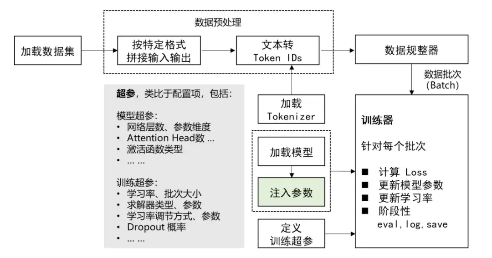

**分享内容**

1. GPT模型特性与应用场景(诗词、对联、文章)

2. 数据集构建规范

3. 本地训练全流程实践


## 模型特性与应用场景


GPT-2 是基于 Transformer 架构的生成式预训练模型，擅长文本续写与内容生成。Hugging Face 社区针对中文场景衍生了多个专用模型，适用于以下典型场景：

### 多领域生成示例


#### **案例一：现代歌词创作**

gpt-2中文歌词模型：[<span style="color: rgb(36,91,219); background-color: inherit">https://huggingface.co/uer/gpt2-chinese-lyric</span>](https://huggingface.co/uer/gpt2-chinese-lyric)

```python
from transformers import GPT2LMHeadModel,BertTokenizer,TextGenerationPipeline

model_id = "uer/gpt2-chinese-lyric"
tokenizer = BertTokenizer.from_pretrained(model_id)
model = GPT2LMHeadModel.from_pretrained(model_id)
#创建模型推理对象
text_generator = TextGenerationPipeline(model,tokenizer)
out = text_generator("雨滴敲打玻璃窗",max_length=100,do_sample=True)
print(out)
```

**技术要点**：

* BertTokenizer ：用于将输入文本转换为模型可以处理的格式。这里我们使用预训练的uer/gpt2-chinese-lyric 模型的分词器。&#x20;

* GPT2LMHeadModel ：GPT-2 模型的实现，专注于语言模型的生成任务。&#x20;

* TextGenerationPipeline ：Hugging Face 提供的简化工具，用于快速生成文本。它结合了模型和分词器，简化了推理过程。&#x20;

* do\_sample=True ：启用随机采样，使得每次生成的文本可能不同，这有助于生成多样化的结果。


#### **案例二：中文文言文生成**

gpt-2中文文言文模型：[<span style="color: rgb(36,91,219); background-color: inherit">https://hugggingface.co/uer/gpt2-chinese-ancient</span>](https://huggingface.co/uer/gpt2-chinese-ancient)

```python
from transformers import BertTokenizer,GPT2LMHeadModel,TextGenerationPipeline
model_id = "uer/gpt2-chinese-ancient"
tokenizer = BertTokenizer.from_pretrained(model_id)
model = GPT2LMHeadModel.from_pretrained(model_id)
#device=0 指定当前的推理设备为第一块GPU;如果没有GPU环境，就去掉该参数
text_generator = TextGenerationPipeline(model,tokenizer,device=0)
out = text_generator("昔者庄周梦为胡蝶",max_length=100,do_sample=True)
print(out)
```

**解释**：

* device=0 ：指定使用第一个 GPU 进行计算。如果系统有多个 GPU，可以通过改变设备编号选择&#x20;
  其他 GPU。&#x20;

* max\_length=100 ：设置生成文本的最大长度，以确保生成的文本不会超出指定的字符数。


#### **案例三：中文对联生成**

gpt-2中文对联模型：[<span style="color: rgb(36,91,219); background-color: inherit">https://huggingface.co/uer/gpt2-chinese-couplet</span>](https://huggingface.co/uer/gpt2-chinese-couplet)

```python
from transformers import BertTokenizer,GPT2LMHeadModel,TextGenerationPipeline

model_id = "uer/gpt2-chinese-couplet"
tokenizer = BertTokenizer.from_pretrained(model_id)
model = GPT2LMHeadModel.from_pretrained(model_id)
#device=0 指定当前的推理设备为第一块GPU;如果没有GPU环境，就去掉该参数
text_generator = TextGenerationPipeline(model,tokenizer,device=0)
out = text_generator("[CLS]五湖四海皆春色 -",max_length=28,do_sample=True)
print(out)
```

**解释：&#x20;**

* \[CLS] **标记**：特殊标记，用于标记对联的开头。生成的对联会以 \[CLS] 为开头，模型将生成后续&#x20;
  部分。


#### **案例四：中文古诗生成**

gpt-2中文古诗模型：[<span style="color: rgb(36,91,219); background-color: inherit">https://huggingface.co/uer/gpt2-chinese-poem</span>](https://huggingface.co/uer/gpt2-chinese-poem)

```python
from transformers import BertTokenizer,GPT2LMHeadModel,TextGenerationPipeline
model_id = "uer/gpt2-chinese-poem";
tokenizer = BertTokenizer.from_pretrained(model_id)
model = GPT2LMHeadModel.from_pretrained(model_id)
#device=0 指定当前的推理设备为第一块GPU;如果没有GPU环境，就去掉该参数
text_generator = TextGenerationPipeline(model,tokenizer,device=0)
out = text_generator("[CLS]枯藤老树昏鸦，",max_length=50,do_sample=True)
print(out)
```

**解释：**

* max\_length=50 ：设置生成文本的最大长度，确保古诗生成结果不超出指定长度。


#### **案例五：中文文章生成**

gpt-2中文文章模型：[<span style="color: rgb(36,91,219); background-color: inherit">https://huggingface.co/uer/gpt2-chinese-cluecorpussmall</span>](https://huggingface.co/uer/gpt2-chinese-cluecorpussmall)

```python
from transformers import BertTokenizer,GPT2LMHeadModel,TextGenerationPipeline
model_id = "uer/gpt2-chinese-cluecorpussmall";
tokenizer = BertTokenizer.from_pretrained(model_id)
model = GPT2LMHeadModel.from_pretrained(model_id)
#device=0 指定当前的推理设备为第一块GPU;如果没有GPU环境，就去掉该参数
text_generator = TextGenerationPipeline(model,tokenizer,device=0)
out = text_generator("这是很久之前的事情了，",max_length=100,do_sample=True)
print(out)
```

**解释：**

* max\_length=100 ：设置生成文章的最大长度，以确保生成的内容符合预期长度


## 数据集构建规范

### 数据格式标准


训练数据需满足以下要求：

> 示例文件: classical\_poetry.txt
>
> ***
>
> 醉里挑灯看剑，梦回吹角连营。
>
> 大漠孤烟直，长河落日圆。

**解释：&#x20;**&#xA;● **每行一首古诗**：数据集中的每一行代表一个训练样本。数据的格式和内容直接影响模型的训练效果。&#x20;
● **文件编码**：确保文件使用 UTF-8 编码，以正确处理中文字符。

## &#x20;本地训练全流程实践



### 数据预处理方案


构建可迭代数据集对象：

```python
from torch.utils.data import Dataset

class MyDataset(Dataset):
    def __init__(self):
        with open("data/classical_poetry.txt", encoding="utf-8") as f:
            lines = f.readlines()
        #去除每数据的前后空格
        lines = [i.strip() for i in lines]
        self.lines = lines
    def __len__(self):
        return len(self.lines)
    def __getitem__(self, item):
        return self.lines[item]

if __name__ == '__main__':
    dataset = MyDataset()
    print(len(dataset),dataset[-1])
```

**解释：&#x20;**

* **数据加载**：&#x20;

  * init 方法中读取数据文件并去除每行的空白字符，确保数据清洁。&#x20;

* **数据集长度和索引**：&#x20;

  * len 方法返回数据集中样本的数量，供 DataLoader 使用。&#x20;

  * getitem 方法根据索引返回对应的样本数据。

### 模型训练代码


在训练机器学习模型时，通常会输出一些指标来帮助我们理解模型的训练过程和性能。以下是你提到的几个参数的通俗解释：


#### **训练指标**


1. **loss（损失）**

   1. **含义**：损失值是一个衡量模型预测与实际标签之间差异的指标。损失值越小，表示模型的预测结果越接近真实值。

   2. **例子**：假设我们在训练一个猫狗分类器，损失值为0.7493表示模型在当前训练状态下，预测结果与实际标签之间的差异程度。损失值越小，说明模型的预测越准确。

   3.

2. **grad（梯度）**

   **什么是梯度？**

   1. **定义**：

      * 梯度是一个向量，表示函数在某一点的方向导数。它指示了函数在该点上升最快的方向。

      * 在数学上，梯度是一个多元函数的偏导数的集合。

   2. **在神经网络中的作用**：

      * 在神经网络中，梯度用于更新模型的参数（如权重和偏置），以最小化损失函数。

      * 损失函数是一个衡量模型预测与真实标签之间差异的函数。通过最小化损失函数，模型的预测能力得以提高。

   **梯度下降法**

   1. **基本原理**：

      * 梯度下降法是一种优化算法，用于通过迭代更新模型参数来最小化损失函数。

      * 在每次迭代中，计算损失函数相对于每个参数的梯度，然后沿着梯度的反方向更新参数。

   2. **更新公式**：

      * 参数更新的公式为：<span style="color: inherit; background-color: rgb(187,191,196)">θ = θ - α * ∇L(θ)</span>

      * 其中，<span style="color: inherit; background-color: rgb(187,191,196)">θ</span>是参数，<span style="color: inherit; background-color: rgb(187,191,196)">α</span>是学习率，<span style="color: inherit; background-color: rgb(187,191,196)">∇L(θ)</span>是损失函数关于参数的梯度。


   3. **学习率**：

      * 学习率是一个超参数，决定了每次更新的步长。

      * 学习率过大可能导致训练不稳定，学习率过小则可能导致收敛速度慢。

   **在代码中的体现**

   在你的代码中，梯度的计算和应用主要体现在以下部分：

```python
# 反向传播，计算损失的梯度，用于更新模型参数。
loss.backward()

# 对梯度进行裁剪，防止梯度过大导致训练不稳定。
torch.nn.utils.clip_grad_norm_(model.parameters(), 1.0)

# 使用优化器更新模型的权重参数。
optimizer.step()

# 清空优化器中的梯度缓存，准备下一次迭代。
optimizer.zero_grad()
```

* loss.backward()：计算损失函数相对于模型参数的梯度。

* torch.nn.utils.clip\_grad\_norm\_()：对梯度进行裁剪，防止梯度爆炸。

* optimizer.step()：根据计算出的梯度更新模型参数。

* optimizer.zero\_grad()：清空梯度缓存，以免影响下一次迭代。


通过这些步骤，模型的参数在每次迭代中逐渐调整，以最小化损失函数，从而提高模型的性能。


* **grad\_norm（梯度范数）**

  1. **含义**：梯度范数是一个衡量模型参数更新幅度的指标。它反映了模型在当前训练步骤中，参数调整的大小。过大的梯度可能导致训练不稳定。

  2. **例子**：在训练过程中，如果grad\_norm为31.5907，说明模型参数在这一轮训练中调整的幅度较大。通常，我们希望梯度范数适中，以确保模型稳定收敛。

* **learning\_rate（学习率）：**

  1. **含义**：学习率是一个超参数，决定了模型在每次更新时，参数调整的步长。学习率过大可能导致模型不收敛，过小则可能导致训练速度过慢。

  2. **例子**：学习率为1.354e-05表示每次参数更新时，模型的调整步长非常小。这通常用于精细调整模型参数，以提高模型的精度。

* **epoch（轮次）**

  1. **含义**：一个epoch表示模型已经完整地遍历了一遍训练数据集。通常，训练需要多个epoch以确保模型充分学习数据特征。

  2. **例子**：epoch为0.73表示模型已经完成了73%的第一轮训练。通常，我们会设置多轮训练以提高模型的性能。

这些参数帮助我们监控和调整模型的训练过程，以便获得更好的预测性能。


#### **训练代码**


```python
# 导入transformers库中的AdamW优化器
# AdamW是一种优化算法，用于更新神经网络的权重参数。它在Adam优化器的基础上加入了权重衰减，帮助防止过拟合。
from transformers import AdamW

# 导入transformers库中的优化器调度器获取函数
# get_scheduler函数用于创建学习率调度器，帮助在训练过程中动态调整学习率。
from transformers.optimization import get_scheduler

# 导入PyTorch库
# PyTorch是一个流行的深度学习框架，提供了构建和训练神经网络的工具。
import torch

# 导入自定义的数据集类MyDataset
# MyDataset是一个自定义的数据集类，用于加载和处理训练数据。
from data import MyDataset

# 导入transformers库中的自动分词器
# AutoTokenizer用于自动加载预训练的分词器，将文本转换为模型可以理解的数字格式。
from transformers import AutoTokenizer

# 导入transformers库中的因果语言模型和GPT2模型
# AutoModelForCausalLM用于加载因果语言模型，GPT2Model是GPT2模型的具体实现。
from transformers import AutoModelForCausalLM, GPT2Model

# 实例化自定义数据集
# 创建MyDataset类的实例，用于加载和管理训练数据。
dataset = MyDataset()

# 定义模型的标识符
# model_id是预训练模型的标识符，用于指定要加载的模型。
model_id = "uer/gpt2-chinese-cluecorpussmall"

# 加载预训练的编码器（分词器）
# 使用AutoTokenizer从预训练模型中加载分词器，将文本转换为模型可以理解的格式。
tokenizer = AutoTokenizer.from_pretrained(model_id)

# 加载预训练的模型
# 使用AutoModelForCausalLM从预训练模型中加载因果语言模型，用于生成文本。
model = AutoModelForCausalLM.from_pretrained(model_id)

# 打印模型结构（已注释）
# 打印模型的结构和参数信息，帮助了解模型的组成。
# print(model)

# 定义数据预处理函数，用于将文本编码成模型所需的格式
# collate_fn函数用于对数据进行批量处理，编码文本并添加必要的填充和截断。
def collate_fn(data):
    # 使用分词器对数据进行编码，并添加必要的填充和截断
    # batch_encode_plus方法对输入数据进行编码，返回PyTorch张量。
    data = tokenizer.batch_encode_plus(data,
                                       padding=True,  # 填充序列
                                       truncation=True,  # 截断序列
                                       max_length=512,  # 最大序列长度
                                       return_tensors='pt')  # 返回PyTorch张量

    # 创建标签，与输入ID相同
    # 将输入ID的副本作为标签，用于计算损失。
    data['labels'] = data['input_ids'].clone()
    return data

# 创建数据加载器，用于批量加载数据
# DataLoader用于批量加载数据，支持多线程数据加载和数据打乱。
loader = torch.utils.data.DataLoader(
    dataset=dataset,  # 指定数据集
    batch_size=10,  # 指定批量大小
    collate_fn=collate_fn,  # 指定预处理函数
    shuffle=True,  # 打乱数据
    drop_last=True,  # 如果最后一个批次不足，则丢弃
)

# 打印数据加载器中的批次数量，帮助了解数据集的大小。
print(len(loader))

# 定义训练函数
# train函数用于执行模型的训练过程。
def train():
    global model  # 使用全局变量model
    # 确定使用CPU还是GPU
    # 根据系统环境选择使用CPU还是GPU进行训练。
    device = 'cuda' if torch.cuda.is_available() else 'cpu'
    # 将模型加载到指定的设备上，以便进行计算。
    model = model.to(device)

    # 实例化优化器，AdamW优化器用于更新模型的权重参数。
    optimizer = AdamW(model.parameters(), lr=2e-5)

    # 创建学习率调度器，帮助在训练过程中动态调整学习率。
    scheduler = get_scheduler(name='linear',  # 线性调度器
                              num_warmup_steps=0,  # 预热步数
                              num_training_steps=len(loader),  # 总训练步数
                              optimizer=optimizer)

    # 设置模型为训练模式
    model.train()

    # 遍历数据加载器中的每个批次，进行训练。
    for i, data in enumerate(loader):
        # 将数据加载到指定的设备上，以便进行计算。
        for k in data.keys():
            data[k] = data[k].to(device)

        # 通过模型进行前向传播，计算输出。
        out = model(**data)

        # 从模型输出中获取损失值，用于反向传播。
        loss = out['loss']

        # 反向传播，计算损失的梯度，用于更新模型参数。
        loss.backward()

        # 对梯度进行裁剪，防止梯度过大导致训练不稳定。
        torch.nn.utils.clip_grad_norm_(model.parameters(), 1.0)

        # 使用优化器更新模型的权重参数。
        optimizer.step()

        # 使用调度器更新学习率。
        scheduler.step()

        # 清空优化器中的梯度缓存，准备下一次迭代。
        optimizer.zero_grad()
        model.zero_grad()
        
         # 每隔1个批次打印一次训练信息，包括损失、学习率和准确率。
        if i % 1 == 0:
            # 准备标签和输出用于计算准确率
            # 提取标签和模型输出，用于计算准确率。
            labels = data['labels'][:, 1:]
            #通过‘logits’获取模型的原始输出值
            out = out['logits'].argmax(dim=2)[:, :-1]

            # 通过选择非填充部分的数据，计算准确率。
            # 移除在数据预处理阶段添加的填充（通常是0），以便只计算实际数据部分的损失和准确率，避免填充部分对模型性能评估的影响。
            select = labels != 0
            labels = labels[select]
            out = out[select]
            del select

            # 计算预测值与真实标签的匹配程度，得到准确率。
            accuracy = (labels == out).sum().item() / labels.numel()

            # 从优化器中获取当前的学习率。
            lr = optimizer.state_dict()['param_groups'][0]['lr']

            # 打印当前批次的索引、损失值、学习率和准确率。
            print(i, loss.item(), lr, accuracy)

    # 将训练好的模型参数保存到文件中，以便后续使用,不保存模型结构
    torch.save(model.state_dict(), 'save/net.pt')

    # 打印提示信息，表示模型参数已成功保存。
    print("权重保存成功！")

# 当脚本作为主程序运行时，执行以下代码
# 检查脚本是否作为主程序运行，如果是，则执行训练过程。
if __name__ == '__main__':
    # 设置训练的周期数，这里只进行1个epoch。
    for epoch in range(1):
        # 执行训练函数，开始训练模型。
        train()
```

**解释：&#x20;**

* **数据加载器**：&#x20;

  * collate\_fn ：批量数据处理，将文本编码为模型可以处理的格式，并创建标签。&#x20;

* **训练过程**：&#x20;

  * **设备选择**：根据系统是否支持 GPU 来选择计算设备。&#x20;

  * **优化器**：使用 AdamW 优化器进行模型训练。&#x20;

  * **训练循环**：遍历所有数据，进行前向传播、损失计算、反向传播和优化步骤。


### 生成效果验证方案


训练后效果评估脚本：

```python
# 导入torch库，torch是一个流行的深度学习框架，类似于一个工具箱
import torch
# 从transformers库中导入AutoTokenizer类，用于自动加载预训练的分词器
from transformers import AutoTokenizer
# 从transformers库中导入TextGenerationPipeline类，用于生成文本的流水线
from transformers import TextGenerationPipeline
# 从transformers库中导入AutoModelForCausalLM和GPT2Model类，前者用于加载因果语言模型，后者是GPT2模型的具体实现
from transformers import AutoModelForCausalLM, GPT2Model

# 定义一个字符串变量model_id，表示我们要使用的预训练模型的标识符
model_id = "uer/gpt2-chinese-cluecorpussmall";
# 使用AutoTokenizer从预训练模型中加载分词器，分词器的作用是将文本转换为模型可以理解的数字格式
# 例如，如果我们有一句话“你好”，分词器会将其转换为对应的数字序列
tokenizer = AutoTokenizer.from_pretrained(model_id)

# 使用AutoModelForCausalLM从预训练模型中加载因果语言模型
# 这个模型可以用来生成文本，类似于我们给它一个开头，它会自动续写
model = AutoModelForCausalLM.from_pretrained(
    model_id)
# 加载我们自己训练的模型权重，替换掉预训练模型的权重
# 这就像是我们在一个已经训练好的模型上，加入了我们自己的训练结果
model.load_state_dict(torch.load("save/net.pt"))
# 打印模型的结构和参数信息，帮助我们了解模型的组成
print(model)

# 创建一个文本生成流水线，使用我们加载的模型和分词器
# 这个流水线就像是一个自动化的工具，可以根据输入的文本生成新的内容
pipline = TextGenerationPipeline(model, tokenizer)

# 使用流水线生成文本，给定一个开头“天高”，并设置生成文本的最大长度为24个字符
# 例如，输入“天高”，模型可能会生成“天高云淡，望断南飞雁”
print(pipline('天高', max_length=24))
```


### **优化建议**


1. **混合精度训练**：在 TrainingArguments 中设置 fp16=True 加速训练

2. **动态批处理**：使用 DataCollatorForLanguageModeling 实现智能填充

3. **早停机制**：通过 EarlyStoppingCallback 监控验证集损失


官方资源参考： &#x20;

> [<span style="color: rgb(36,91,219); background-color: inherit">Transformers 最佳实践</span>](https://huggingface.co/docs/transformers/perf_train_gpu_one) &#x20;
> [<span style="color: rgb(36,91,219); background-color: inherit">模型微调白皮书</span>](https://arxiv.org/abs/2109.01652)


