&#x20;

### 智能体是什么？

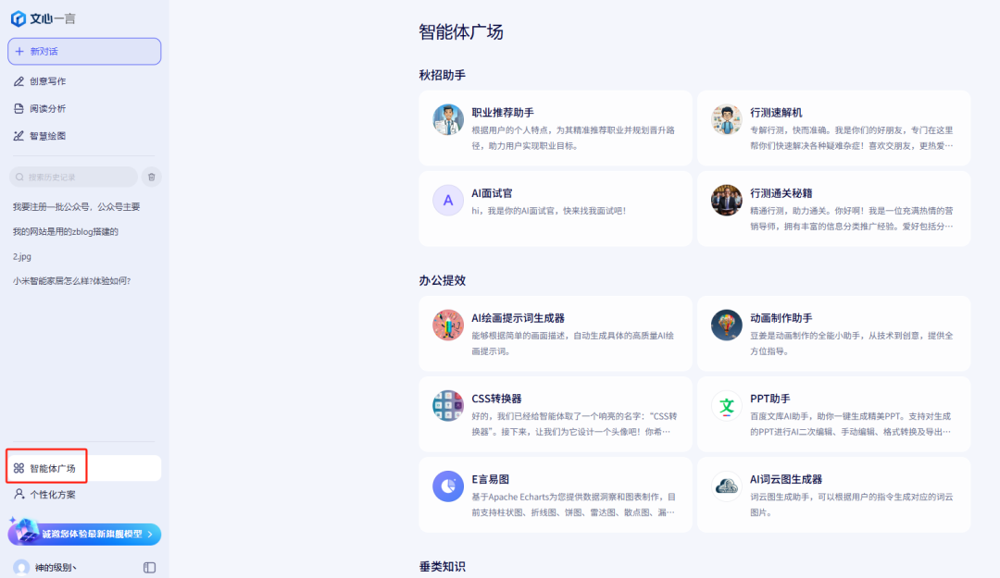

AI是公司的一批新员工，并且没有分工分岗，你每次布置任务的时候，都要跟他讲一遍公司背景、产品介绍以及任务注意事项，很烦。智能体就是你给每个AI分工，你对员工A讲一遍公司行政规范以及日常工作要求，员工A就成了一名优秀的行政，以后行政类的工作你一句话他就秒懂；然后你对B讲一遍公司产品介绍以及销售技巧，B就成了一名优秀的业务，以后随便给他一个产品，他就能给你做专业的产品讲解。

**前排提示，文末有大模型AGI-CSDN独家资料包哦！**

**智能体是对每个员工进行定向培养，专人专岗，分内的事情他最懂你！**

### 为什么需要私⼈AI知识库

是不是厌倦了AI⼀本正经的答⾮所问、套话...等低效的信息检索。

私有知识库在AI时代有⾮常多使⽤场景，尤其是企业内部知识、个⼈知识库等。结合⼀个专业的知识库之后，能够让知识检索和归纳上升⼀个台阶。

通俗的讲，就是给AI定向投喂知识。

没有知识库的AI是个万金油，什么都懂，但是不精，你的智能体把他身份设定为希捷硬盘的业务员，他确实能提供一些希捷硬盘的参数、购买建议，但是如果涉及到一些互联网上的冷门型号或者报价，他可能会胡编或者写不出来。此时，我们如果给他提供大量希捷产品的电子资料，他今后的写作有了专业的资料参考，就能极大提升他的工作质量，这一过程，就是简易的知识库搭建。

**知识库就是对员工深入栽培，由应届生培养成行业大牛。**

上一期我们讲过一个概念，叫AI幻觉，AI幻觉出现的一个重要原因就是大模型本身对这个领域的知识欠缺，我们此时针对性补充该领域知识，能够极大缓解AI幻觉的问题。

元宝和dp官网网页版用起来确实很方便，但是目前还不能让我们自己创建智能体、搭建知识库，此时，我们需要在自己的程序上搭建，你的应用程序通过API调用来实现AI功能。

### 什么是API？

想象一下，你（你的应用程序）渴了想喝霸王茶姬（你有使用AI的需求），但是你又不想亲自去奶茶店（Deepseek），此时，奶茶店上架了美团的外卖（API），你在家里传达你的需求，外卖系统收到你的需求，传达给奶茶店（Deepseek），奶茶店收到需求立刻开始制作奶茶（Deepseek在疯狂工作），奶茶制作完毕由外卖系统派送给你（API传回结果）。这个过程就是API调用。

这张图也是AI帮我做的，第二期我们讲过chatgpt-4o绘画模型有多牛，此处就见识到了。    &#x20;

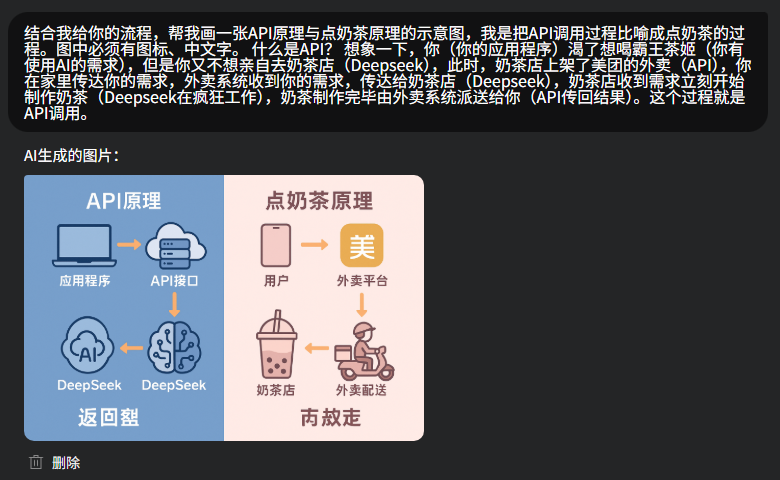

chatgpt对中文处理有一点瑕疵，裁剪掉瑕疵部分。

***

### 搭建智能体和知识库的步骤

**1** **获取硅基流动的 DeepSeek API**

首先我们需要拿到硅基流动的 API KEY。目前注册不用实名都会送 14 元余额，足够用一段时间。我用了一周，花了7毛钱。如果不够钱了，可以直接充值，算下来一篇文章几分钱。

**1.1 打开硅基流动的官网：**  <https://cloud.siliconflow.cn/i/gXdoycZH>

**1.2 注册账户：** 注册后赠送 14 元，可以直接使用，也可选择充值。

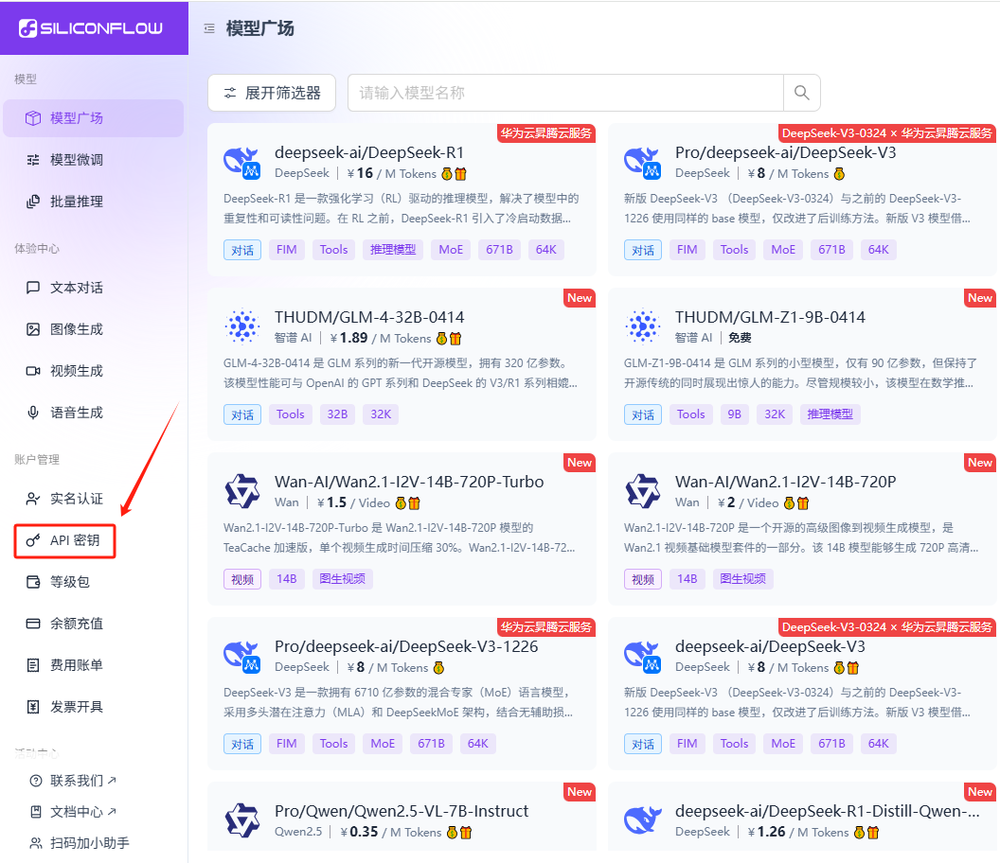

**1.3 获取API密钥：** 在后台的【API 密钥】菜单，点击【新建 API 密钥】，然后**复制**生成的密钥备用。

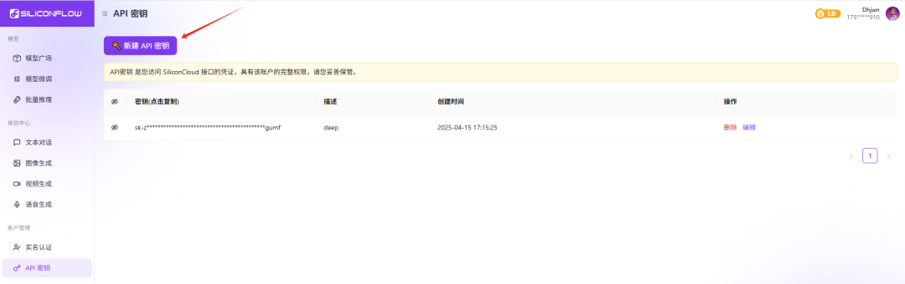

**2** **下载并配置 AI 客户端 (Cherry Studio)**

需要一个自己的 AI 套壳客户端。推荐 Cherry Studio，功能非常丰富，开源免费的，所以推荐给每一个人。

**Cherry Studio 下载地址：**  <https://cherry-ai.com/download>

下载后直接安装，打开运行。

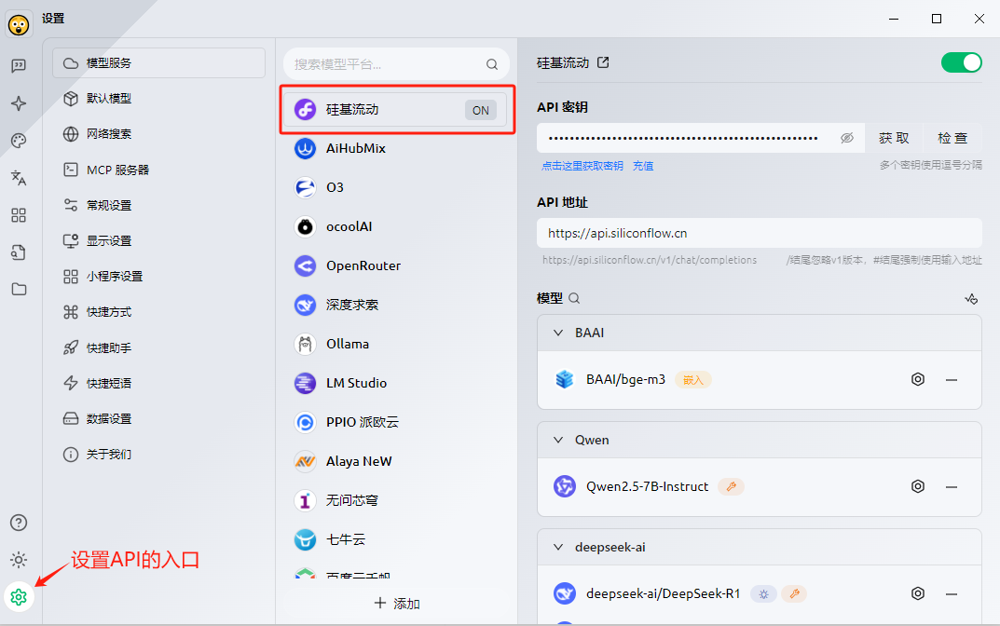

**2.1 配置API：**  点击左下角【设置】图标，进入【API配置】界面。可以看到 Cherry Studio 内置了硅基流动。  粘贴在第1步获取的【API 密钥】，点击【检查】，选择模型版本（如V3），点击【确定】。

然后点击下方的【添加】按钮。会弹出一个添加模型的框。  前往【硅基流动模型广场】，找到 DeepSeek-V3 模型，复制模型名称（如 deepseek-chat 或类似名称）。  粘贴到 Cherry Studio 的【模型ID】处，其他信息会自动填充，点击【添加模型】。

到此，API调用完成，你可以在这个客户端开始对话了。

**3** **创建智能体 (Agent)**

如图，点击左侧菜单栏的【星号】图标（智能体市场），进入智能体创建界面。点击【添加】按钮。

**智能体设置：**

* 【名称】：自己取一个容易识别的名字。

* 【提示词 (Prompt)】：按上期教程，仔细编写、测试和优化提示词，定义智能体的角色、能力和行为。

* 【模型】：选择前面添加的 DeepSeek 模型。

* 【知识库】(可选，稍后配置)：关联后续创建的知识库。

* 【MCP 服务器】(可选，稍后配置)：启用所需的功能。

智能体主要就是借用这个客户端，提前内置提示词，免去了每次都要输入很长提示词的烦恼，也方便管理自己的AI员工。过程很简单，重点在于提示词的质量。

**提示：**&#x43;herry Studio 内置了几百种智能体，不过一般都是比较通用、浅显的。如果你的需求比较简单，可以直接用。但还是建议自己创建智能体，毕竟可以随时调整，实用性更强。            &#x20;

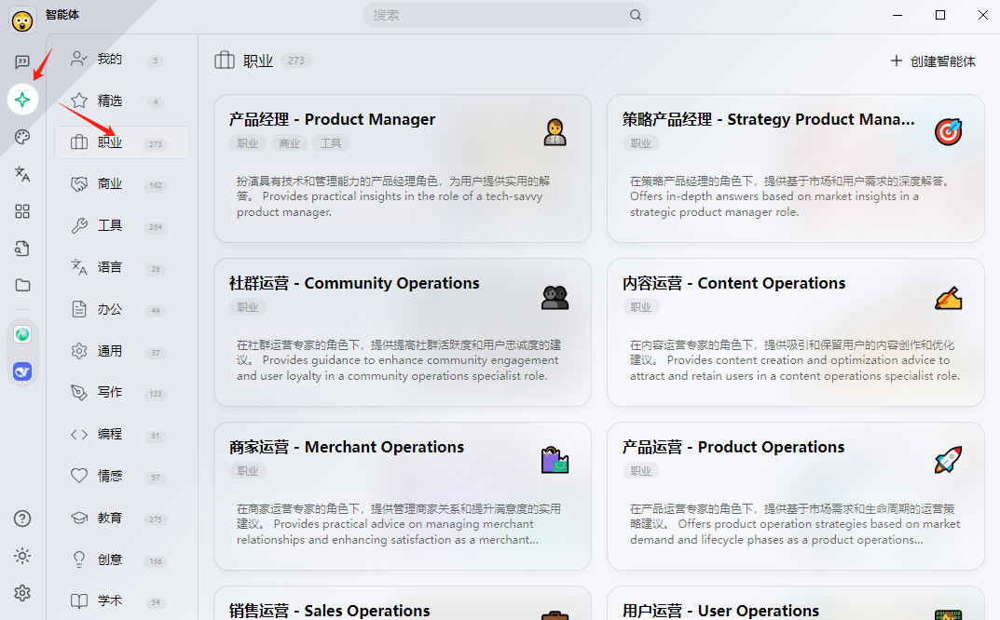

智能体创建很简单，主要就是借助AI壳，提前预设一个提示词即可。但是智能体的作用可不小，它让你杂乱的AI员工，能够变得整洁、思路清晰，并且能不断自我优化。

员工我们已经分工分岗完毕，此时，是时候给他们进行专业培训了，让他们个个都成为行业精英！我们一起看一下，如何为每个智能体创建一个知识库。

**4** **创建知识库 (Knowledge Base)**

创建智能体的时候我们发现，每一个智能体都可以选择一个或者多个知识库，以后每次用这个智能体的时候，AI都会检索知识库，获取更专业的参考。

**4.1 添加嵌入模型和重排序模型**

在创建知识库之前，我们还需要2个模型工具：【嵌入模型】 (Embedding Model) 和【重排序模型】 (Reranker Model)。大家不要害怕，这两个安装是傻瓜式操作，3秒就完事！

**嵌入模型是必备模型**，用于分析我们本地知识库。   **重排序模型是可选模型**，但它对提升检索知识库的精度作用十分明显，大家不要偷懒!

**添加嵌入模型：**

* 前往【硅基流动模型广场】，筛选【嵌入 (Embedding)】，选择第一个【BAAI/bge-m3】，复制其名称 BAAI/bge-m3。

* 回到 Cherry Studio，点击左下角【设置】-> 【API配置】 -> 选择【硅基流动】 -> 点击【添加】。

* 在【模型ID】处粘贴复制的模型名称 BAAI/bge-m3，其他地方会自动填好，点击【添加模型】。

**添加重排序模型：**

* 同理，在【硅基流动模型广场】，筛选【重排序 (Rerank)】，复制模型名称 BAAI/bge-reranker-v2-m3。

* 回到 Cherry Studio 的【API配置】->【硅基流动】->【添加模型】，粘贴模型ID并添加。

**4.2 创建知识库**

点击左侧菜单栏的【书本】图标（知识库），点击【添加】按钮。

**知识库设置：**

* 【名称】：自己命名，方便识别。

* 【嵌入模型】：选择刚添加的 BAAI/bge-m3。

* 【重排模型】：选择刚添加的 BAAI/bge-reranker-v2-m3。

* 点击【确定】。

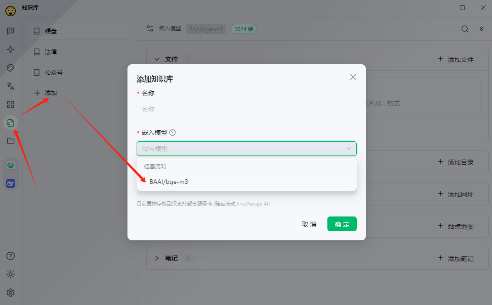

**4.3 补充知识库内容**

我们可以看到知识库文件上传支持5种方式，这也是我目前用过的工具里支持最多上传方式的知识库了。选择适合你的方式添加内容：

1. **单个上传文档：**&#x76F4;接上传 PDF, Word, TXT 等文件。

2. **上传文件目录：\***\*【建议】\*\*一次性上传整个文件夹，支持格式的文件会被自动处理。

3. **上传网址：\***\*【建议】\*\*直接粘贴网址，如飞书文档、Notion页面等。

4. **上传网站地图：\***\*【建议】\*\*支持 XML 格式的站点地图 (sitemap.xml)，可以批量抓取网站内容。

5. **添加笔记：**&#x76F4;接在客户端内创建和添加文本笔记。

**关于“网站地图”：** 这个方式最暴力好用。网站地图通常是 \`域名/sitemap.xml\` 或 \`域名/sitemap.txt\`。如果一个网站内容很好，可以试试访问“域名+/sitemap.xml”。如果能打开并看到很多 URL 列表，就可以直接将这个地图地址添加到知识库。            &#x20;

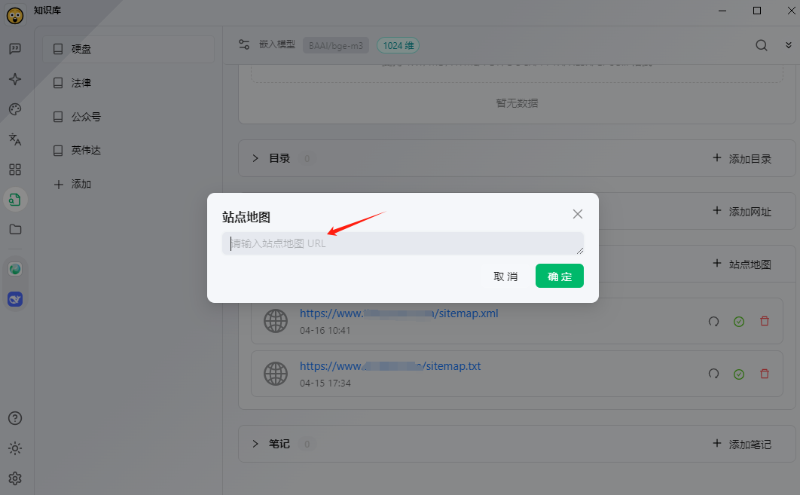

添加完内容，工具会对内容做拆解识别。等待文件/网址/地图后面的蓝色小圆点变成**绿色对钩**，就说明已经识别完毕，可以使用了。

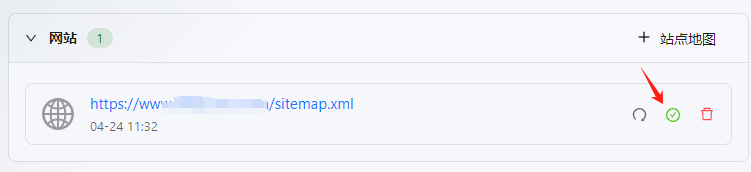

**测试知识库：** 点击知识库界面右上角的【搜索】图标，输入一个知识库内的关键词，看看能否精准检索到内容。当出现相关内容时，就说明知识库已经建好了。

**关联知识库到智能体：**

* 现在，可以在【创建智能体】或【编辑智能体】的设置界面，选择刚才创建的知识库进行关联。

* 每个智能体可以关联多个知识库。

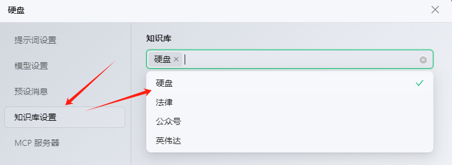

知识库创建完成！现在你的智能体可以基于你提供的专业知识进行回答了。

这里出现了一个MCP服务器，这个也是强烈建议大家添加的辅助功能。大家记住上图的界面，后面添加MCP也是在这里勾选的，我们不再赘述。

**4.4** **(可选) 配置 MCP 服务器**

**4.4.1 MCP 是个啥？**

简单说，MCP (Model Context Protocol) 就是让 AI 从“只会说”变成“能动手”的关键技术。

你想象一下，你有个聪明绝顶的 AI 助手，比如 ChatGPT 或 Claude，它能写报告、讲段子、编代码，啥都会，但你一让它动手干点事，比如看个文件、发封邮件、查实时天气，它立刻原地瘫痪！

举几个真实例子你就明白了：

* 你问它：“今天北京天气咋样？” AI 回答：“不知道，我的知识截止到 XXXX 年”

* 你说：“帮我看看这个 Excel 表格有没有问题” AI 回答：“请把内容复制给我看看，我无法直接打开文件”

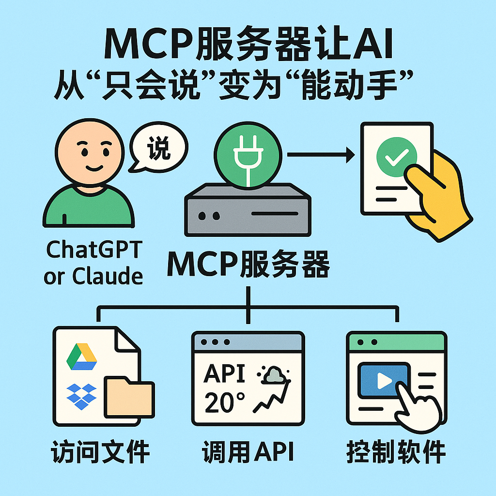

*（图片由 gpt-4o 绘制）*

**总结一下：AI 现在嘴很溜，但手脚不听使唤。而 MCP，就是给 AI 接上“手”和“眼”的工具包，让它能与外部世界互动。**

MCP 到底是干啥的？ MCP 的作用就像一个“万能插座”，让 AI 能够轻松连接到各种数据源和工具，例如：

* 访问你的文件 (如 Google Drive, Dropbox, 本地硬盘)；

* 操作各种 API (如天气查询, 股票行情, 行程安排)；

* 控制软件 (如运行 Python 脚本, 编辑 Word 文档, 管理 GitHub 仓库)。

**4.4.2 MCP 服务器配置**

点击左下角【设置】，选择【MCP服务器】。

**安装环境：** 点击右上角的红色提醒（如果未安装），安装所需的依赖环境 (通常会自动提示并点击安装即可)。

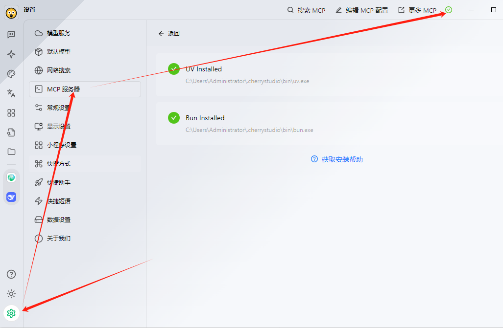

**添加MCP：** 点击上方的【搜索MCP】按钮，会列出官方推荐的几个MCP服务器，并附带简介。选择你需要的MCP (例如，用于文件操作、网页浏览等)，点击其右上角的【+】号，会自动配置安装。

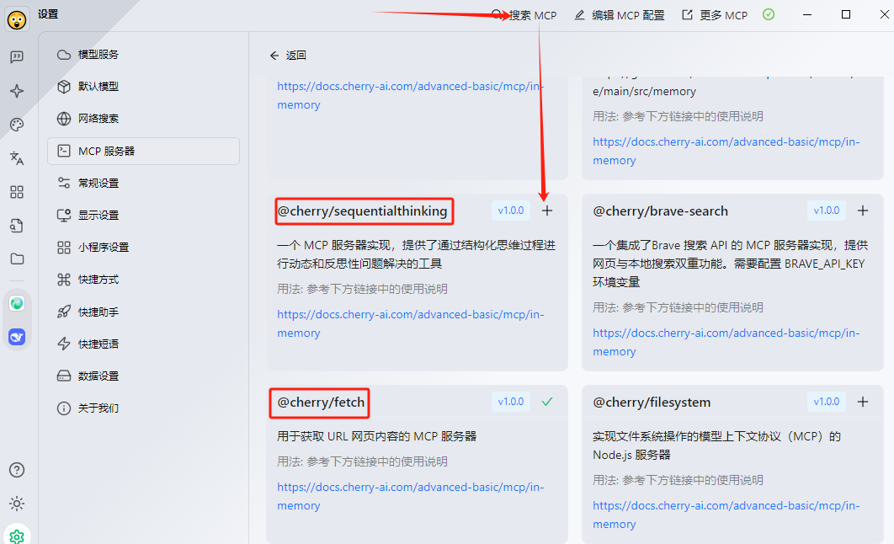

**启用MCP：** 安装后，在【MCP服务器】设置界面，找到已安装的MCP，打开右侧的【启用】开关。

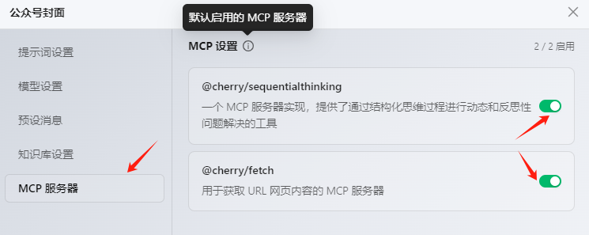

**关联到智能体：** 最后，在【编辑智能体】的设置界面，勾选需要启用的 MCP 服务器。

市场上的MCP服务器有很多不同的功能，需要大家自行探索不同的MCP。

***

**同步提示：**&#x43;herry Studio 是单机的，但是也有数据同步功能，可以多台电脑同步数据，有兴趣的可以研究研究。     &#x20;

**本期内容讲解完毕，主要是教大家搭建简易的智能体以及知识库，重在实操，步骤非常简单，但是实用性非常强。可以搭建行业知识库，可以批量拆解对标自媒体账号文风进行仿写，更多功能等待大家自行探索。**

&#x20;&#x20;
