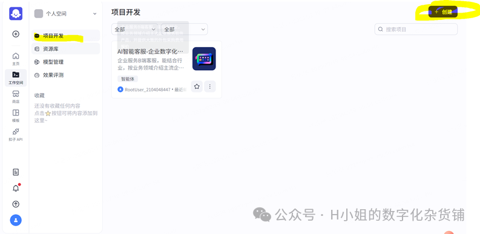
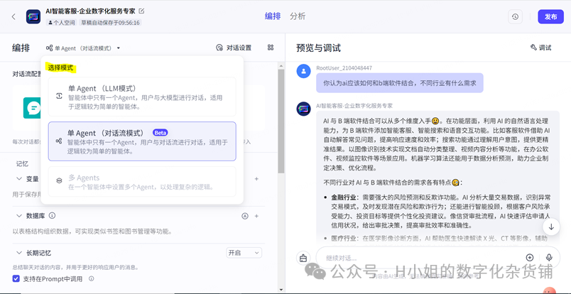
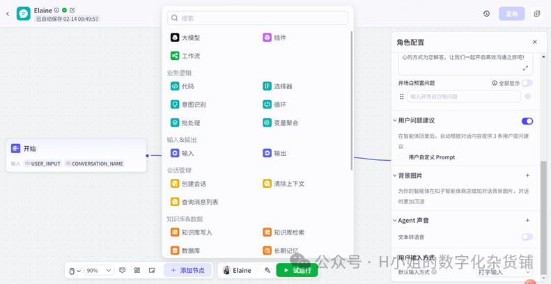
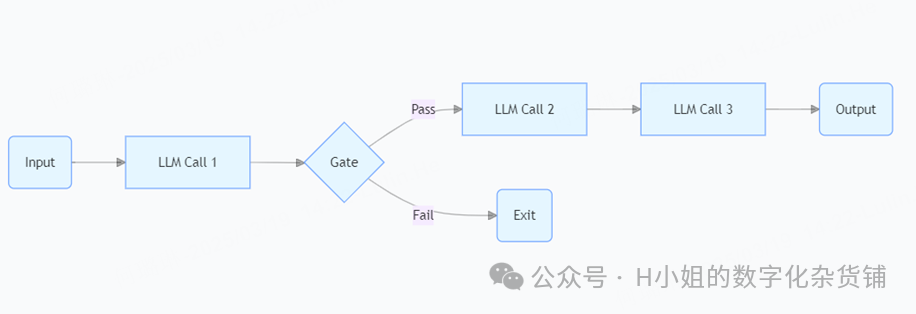
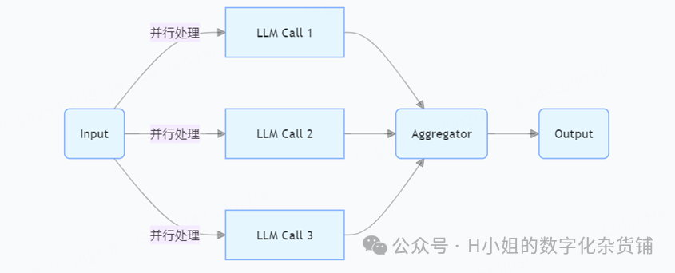
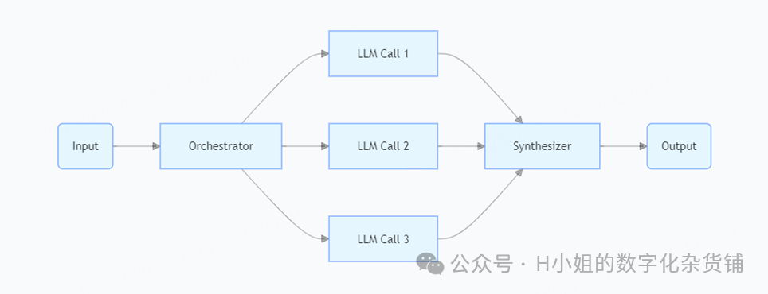
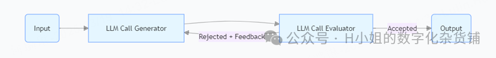
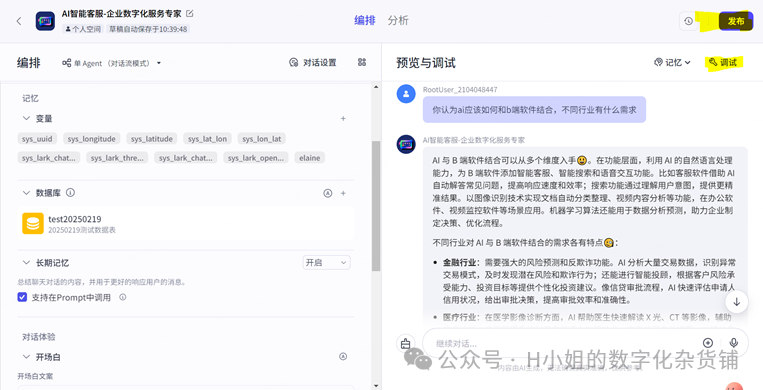
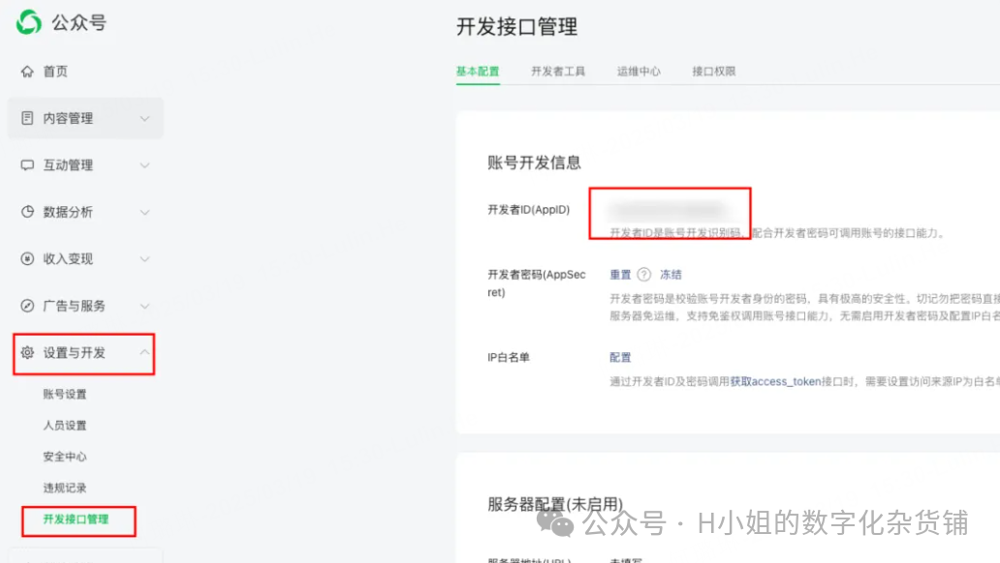

&#x20;

下面以一个企业数字化服务的咨询公司的智能客服为例，介绍To B智能客服如何搭建。广义上来说，To C企业的智能客服应用更广，尤其是在售前咨询和售后争议解决方面，在数量级、AI场景丰富程度、SOP流程上都有更广的空间，但由于过往经验的限制（主要是知识库数据隐私限制），目前仅以To B企业数字化服务的咨询公司的智能客服来举例说明。除了COZE外，Dify也是一个很好的低代码的智能客服搭建工具，另外，LangChain和Ollama也是非常主流的应用开发框架或本地化 LLM 部署工具，并且可以搭配使用，Dify和Ollama的集成可以实现本地化部署与隐私保护，本次不做过多的技术选型讨论，下面是基于COZE的搭建流程说明（由于本人最近有点忙，这个智能客服的工作流和知识库还在迭代中，虽然已经接入本微信公众号示例，但是精细化程度估计不足，大家图个乐子，别当真，本人也没有公司提供相关产品，哈哈哈）。

**第一步：点击官网，并进行注册**

**第二步：选择模式（单/多agent）**

**第三步：配置对话流**

**这一步是智能客服智能体里面的重要设置环节，通俗的来说，你可以配置流程，设置提示词，配置角色名称、角色设置、开场白。也可以设置调用的组件，其中知识库中，除了可以根据行业、产品、用户、业务场景、客服场景设计相应的内容，也可以设置召回量，最小匹配度等。**

第三步：配置对话流 这一步是智能客服智能体里面的重要设置环节，通俗的来说，你可以配置流程，设置提示词，配置角色名称、角色设置、开场白。也可以设置调用的组件，其中知识库中，除了可以根据行业、产品、用户、业务场景、客服场景设计相应的内容，也可以设置召回量，最小匹配度等。 对于目前agent模式尚未实现，更多是是LLM的工作流形式，**主流的workflow**有以下几种形式，供大家参考，根据需要选择。 个人觉得路由器在智能客服分流上可能较为匹配，有较强的适用性。

1、链式工作流（Chain Workflow）模式：第一，每个大语言模型的调用顺序是固定的。第二，链式工作流上一个步骤的输出结果，作为下一个步骤的输入。&#x20;

2、并行化工作流（Parallelization Workflow）模式：第一，同时调用多个大语言模型，并行处理，这些调用可以同时进行，无需等待其他大语言模型调用完成。第二，输出结果前，采用聚合器，整合之前调用多个大语言模型。&#x20;

3、路由工作流（Routing Workflow）模式：第一，先由路由器判断任务分配给哪个大语言模型，路由器根据输入数据的特征、内容或其他相关因素，决定将数据发送到哪个大语言模型。第二，大语言模型根据路由器分配，处理相关任务。&#x20;

4、编排器-工作者（Orchestrator-Worker）模式：并行化工作流和路由工作流的结合。第一，编排器分配任务给不同的大语言模型。第二，合成器将不同LLM调用的结果进行综合处理，生成输出。&#x20;

5、评估器-优化器（Evaluator-Optimizer）模式：第一，生成器生成结果，评估器给出迭代优化策略。第二，生成器和评估器互相配合，持续优化，输出最优结果。&#x20;

提示词工程这里说人话就是帮助机器更好的理解你的问题你的情景你要解决的问题你要了解的信息，你可以通过提示词，决定你的客服是活泼的、理性的，回复是简洁高效还是全面严谨，设置她的回复偏好等等。下面是现在较为**主流的提示词工程模型**：&#x20;

1、ICIO 框架：&#x20;

• Intruction（任务）：明确指出希望 AI 执行的具体任务，如“翻译一段文本”或“撰写一篇关于 AI 伦理的博客文章”。&#x20;

• Context（背景）：提供任务的背景信息，帮助 AI 理解任务的上下文，例如，“这段文本是用于公司内部会议的开场白”。&#x20;

• Input Data（输入数据）：指定 AI 需要处理的具体数据，如“请翻译以下句子：‘人工智能正在改变世界’”。&#x20;

• Output Indicator（输出格式）：设定期望的输出格式和风格，例如，“请以正式的商务英语风格翻译”。&#x20;

2、BROKE 框架：&#x20;

• Background（背景）：例如，“你正在为一家初创科技公司撰写一篇关于其最新产品的新闻稿。”&#x20;

• Role（角色）：指定 AI 作为“新闻稿撰写者”，以便它能够以专业的角度回答问题。&#x20;

• Objectives（目标/任务）：给出任务描述，如“撰写一篇吸引人的新闻稿，突出产品的独特卖点。”&#x20;

• Key Result（关键结果）：设定回答的关键结果，例如，“使用正式和专业的语言，包含产品的主要功能和市场定位。”&#x20;

• Evolve（改进）：在 AI 给出回答后，提供三种改进方法，如“调整语言风格以吸引目标受众”，“增加产品使用案例”，或“优化结构以提高阅读流畅性”。&#x20;

3、CRISPE 框架：&#x20;

• Capacity and Role（角色）：明确 AI 在交互中应扮演的角色，如教育者、翻译者或顾问。&#x20;

• Insight（背景）：提供角色扮演的背景信息，帮助 AI 理解其在特定情境下的作用。&#x20;

• Statement（任务）：直接说明 AI 需要执行的任务，确保其理解并执行用户的请求。&#x20;

• Personality（格式）：设定 AI 回复的风格和格式，使其更符合用户的期望和场景需求。&#x20;

• Experiment（实验）：如果需要，可以要求 AI 提供多个示例，以供用户选择最佳回复。&#x20;

另外，召回量和调用的模型组件也可以根据自己的需求设置，说人话就是在召回量设置上越大，客服回复的字数通常会更多。调用模型组件越多并不是最好的，可能出现精准度不足的问题，带来幻觉问题，并且影响检索效率，出现回复时效较慢的情况。 这里值得注意且深度探索的还有业务逻辑、会话管理、知识库等设置和配置，即积木组件有了，搭成什么样的城堡，完全由我们自主决定。

**第四步： 设置记忆 你可以设置变量，让回复基于用户特征，更加个性化；设置数据库；选择是否采用长期记忆**

**第五步：测试调优，与发布**   &#x20;

**第六步：和微信公众号等外部应用链接API（可选）**

