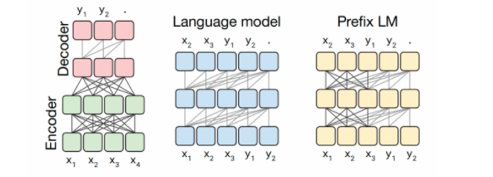
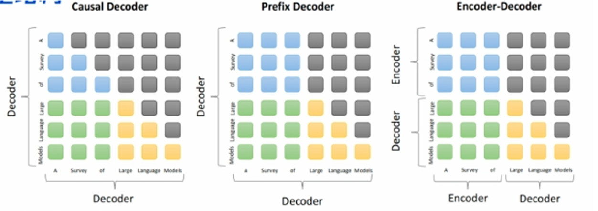

## 一、目前主流的开源模型体系有哪些？

目前主流的开源模型体系分为三种：

* **第一种：prefix Decoder 系**

  * **介绍** ：输入双向注意力，输出单向注意力。

  * **代表模型** ：ChatGLM、ChatGLM2、U-PaLM。

* **第二种：causal Decoder 系**

  * **介绍** ：从左到右的单向注意力。

  * **代表模型** ：LLaMA-7B、LLaMa 衍生物。

* **第三种：Encoder-Decoder**

  * **介绍** ：输入双向注意力，输出单向注意力。

  * **代表模型** ：T5、Flan-T5、BART。

## 二、prefix Decoder 和 causal Decoder 和 Encoder-Decoder 区别是什么？

prefix Decoder、causal Decoder 和 Encoder-Decoder 的区别在于 attention mask 不同：

* **Encoder-Decoder** ：

  * 在输入上采用双向注意力，对问题的编码理解更充分。

  * **适用任务** ：在偏理解的 NLP 任务上效果好。

  * **缺点** ：在长文本生成任务上效果差，训练效率低。

* **causal Decoder** ：

  * 自回归语言模型，预训练和下游应用是完全一致的，严格遵守只有后面的 token 才能看到前面的 token 的规则。

  * **适用任务** ：文本生成任务效果好。

  * **优点** ：训练效率高，zero-shot 能力更强，具有涌现能力。

* **prefix Decoder** ：

  * **特点** ：prefix 部分的 token 互相能看到，是 causal Decoder 和 Encoder-Decoder 的折中。

  * **缺点** ：训练效率低。

## 三、大模型 LLM 的训练目标是什么？

1. **语言模型** ：根据已有词预测下一个词，训练目标为最大似然函数。

2. **去噪自编码器** ：随机替换掉一些文本段，训练语言模型去恢复被打乱的文本段。目标函数实现难度更高，采用去噪自编码器作为训练目标的任务有 GLM-130B、T5。

**训练效率说明** ：Causal Decoder 结构会在所有 token 上计算损失，而 Prefix Decoder 只会在输出上计算损失。

## 四、涌现能力是啥原因？

根据前人分析和论文总结，大致是 2 个猜想：

* 任务的评价指标不够平滑。

* 复杂任务 vs 子任务：假设某个任务 T 有 5 个子任务 Sub-T 构成，每个 Sub-T 随着模型增长，指标从 40% 提升到 60%，但最终任务的指标只从 1.1% 提升到了 7%，即宏观上看到涌现现象，但子任务效果其实是平滑增长的。

## 五、为何现在的大模型大部分是 Decoder-only 结构？

* Decoder-only 结构模型在没有任何微调数据的情况下，zero-shot 的表现能力最好。而 Encoder-Decoder 则需要在一定量的标注数据上做 multitask-finetuning 才能激发最佳性能。

* 目前的 Large LM 的训练范式是在大规模语料上做自监督学习，零样本性能更好的 Decoder-only 架构能更好地利用这些无标注的数据。

* 从理论上看，Encoder 的双向注意力可能存在低秩问题，这可能会削弱模型的表达能力。对生成任务而言，引入双向注意力并无实质好处。而 Encoder-Decoder 模型架构在某些场景下表现更好，大概率是因为其多了一倍参数。因此，在同等参数量、同等推理成本下，Decoder-only 架构是更优的选择。

## 六、简单介绍一下大模型【LLMs】

* **定义** ：大模型一般指 1 亿以上参数的模型，但这个标准在不断升级，目前已有万亿参数以上的模型。大语言模型（Large Language Model，LLM）是针对语言的大模型。

## 七、大模型【LLMs】后面跟的 175B、60B、540B 等指什么？

这些一般指参数的个数，B 是 Billion（十亿）的意思，175B 即 1750 亿参数，这是 ChatGPT 大约的参数规模。

## 八、大模型【LLMs】具有什么优点？

1. 可以利用大量的无标注数据来训练通用的模型，再用少量的有标注数据微调模型以适应特定任务，降低数据标注成本和时间，提升模型泛化能力。

2. 能利用生成式人工智能技术产生新颖、有价值的内容，如图像、文本、音乐等，为创意、娱乐、教育等领域带来更好的体验和效果。

3) 可利用涌现能力（Emergent Capabilities）完成一些之前无法完成或难以完成的任务，像数学应用题、常识推理、符号操作等，反映模型的智能水平和推理能力。

## 九、大模型【LLMs】具有什么缺点？

1. 需消耗大量计算资源和存储资源来训练和运行，增加经济和环境负担。例如，训练一个 GPT-3 模型约需 30 万美元，且产生约 284 吨二氧化碳排放。

2. 要面对数据质量与安全性问题，如数据偏见、数据泄露、数据滥用等，可能导致模型输出不准确或不道德内容，损害用户或社会利益。

3) 还需应对可解释性、可靠性、可持续性等挑战，如理解和控制模型行为、保证模型正确性和稳定性、平衡模型效益和风险等，这些需要各方研究与合作，以保障大模型健康发展。

以下是新增的两个问题：

## 十、大模型【LLMs】主要的应用领域有哪些？

1. **自然语言处理（NLP）领域** ：如文本生成（创作小说、新闻稿、广告文案等）、文本分类（情感分析、垃圾邮件分类等）、问答系统（智能客服、知识问答平台等）、机器翻译（语言互译）、文本摘要（生成文章摘要、新闻摘要等）、语音识别与合成（语音助手、语音导航等）。

2. **图像与视觉领域** ：可应用于图像描述生成（为图片自动生成描述性文字）、图像问答（回答关于图片内容的问题）、图像编辑与生成（根据文字描述生成或修改图像）等。

3) **跨领域应用** ：在医疗健康领域，可用于辅助医学影像分析、医疗文献解读、疾病预测与诊断等；在金融领域，可进行风险评估、投资决策辅助、智能客服等；在教育领域，能实现个性化学习辅导、智能答疑、作文批改等；在工业领域，有助于质量检测、故障诊断、生产流程优化等。

## 十一、大模型【LLMs】如何进行评估与优化？

1. **评估指标** ：

   * **生成质量指标** ：包括 perplexity（困惑度，用于衡量模型对文本的预测能力，值越低表示模型越好）、BLEU（用于评估机器翻译等生成文本与参考文本的相似度）、ROUGE（常用于文本摘要任务的自动评价）。

   * **内容相关性和准确性** ：通过人工评估或与知识库对比，判断模型生成内容是否与输入相关且准确。

   * **连贯性和一致性** ：评估生成文本的逻辑连贯性，是否在长文本生成中保持一致的主题和风格。

   * **零样本（zero-shot）和少样本（few-shot）学习能力** ：考察模型在没有或仅有少量示例的情况下完成新任务的能力。

&#x20; 2\. **优化方法** ：

&#x20;    \* **数据优化** ：增加数据量、提高数据质量、数据增强（如通过同义词替换、句式变换等方式扩充数据集）。

&#x20;    \* **模型架构改进** ：如调整模型的层数、宽度、注意力机制等结构，或采用新的架构设计提升性能。

&#x20;    \* **训练算法优化** ：改进优化器（如采用 AdamW 等更高效的优化算法）、调整学习率调度策略、应用混合精度训练等提高训练效率和效果。

&#x20;    \* **正则化技术** ：防止模型过拟合，如采用 dropout、权重衰减等方法。

&#x20;    \* **持续学习与模型微调** ：在新数据或新任务上对模型进行持续训练，以适应不断变化的数据分布和任务需求。

