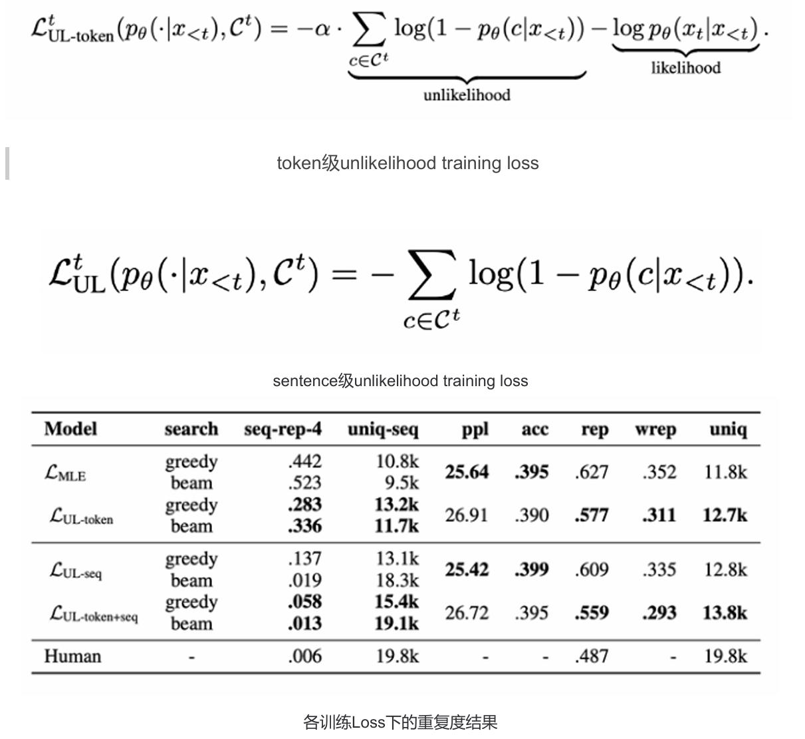
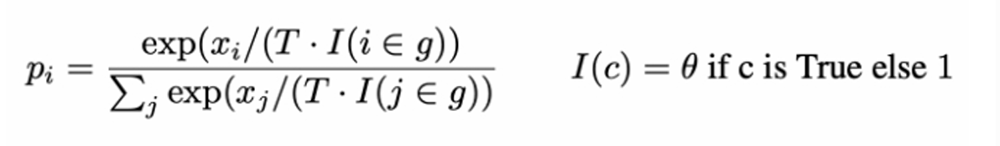
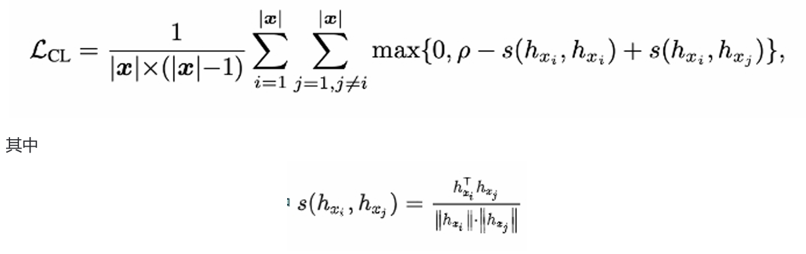
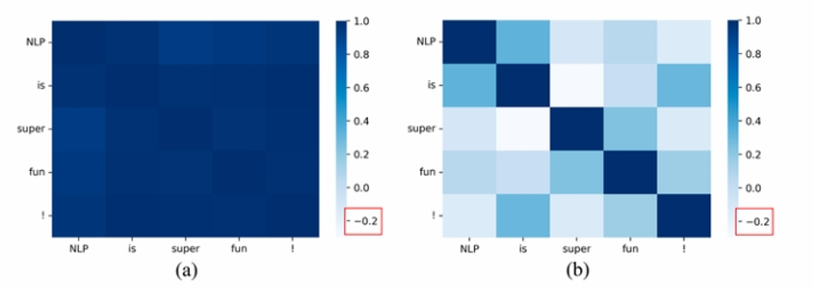
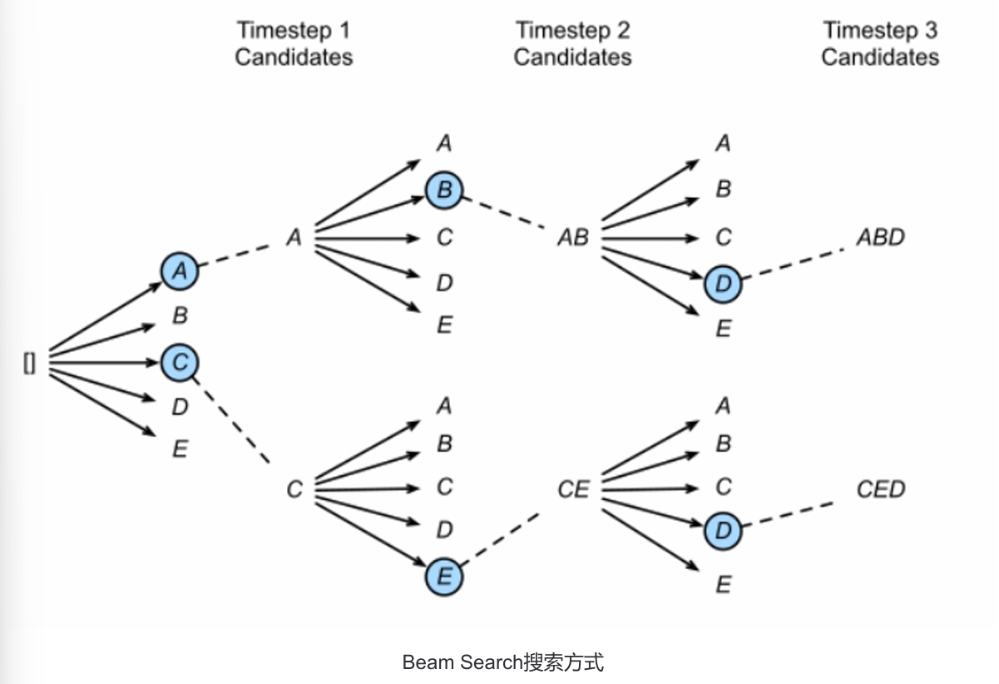
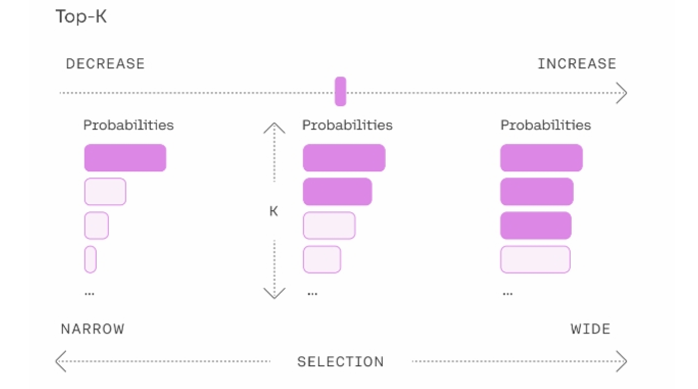
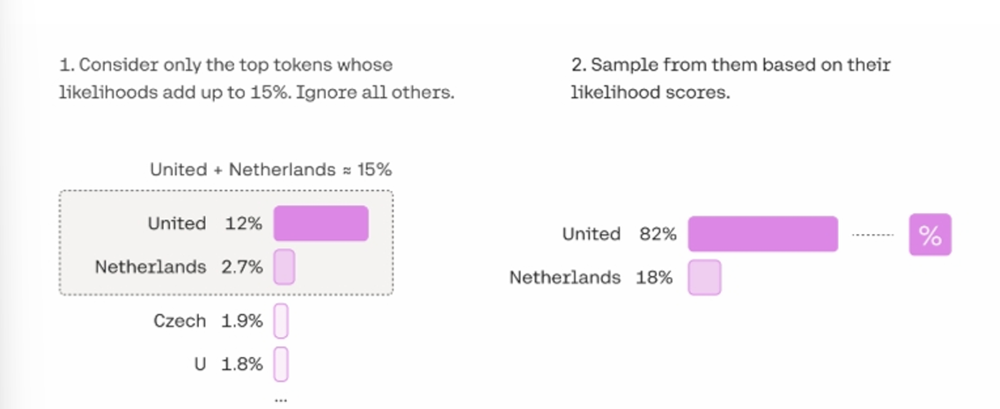
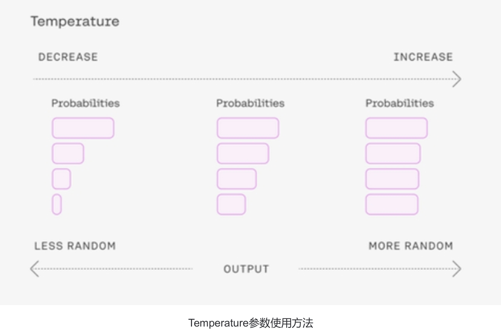
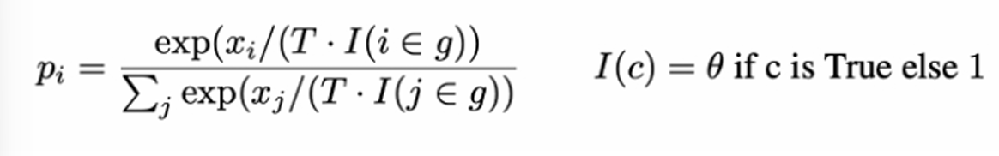

## 一、什么是生成式大模型？

生成式大模型（简称大模型 LLMs）是指能用于创作新内容（如文本、图片、音频、视频等）的深度学习模型。其与普通深度学习模型的主要区别在于：

1. **模型参数量更大**：通常在 Billion 级别。

2. **可通过条件或上下文引导生成内容**：这也是 prompt engineer 产生的基础。

## 二、大模型是怎么让生成的文本丰富而不单调的呢？

### 训练角度：

1. 基于 Transformer 的模型参数量巨大，有助于学习多样化的语言模式与结构。

2. 各种模型微调技术（如 P-Tuning、Lora）降低微调成本，使模型在垂直领域能力增强。

3) 在训练中加入设计好的 loss，抑制生成单调内容。

### 推理角度：

基于 Transformer 的模型引入参数与策略（如 temperature、nucleus sampler）改变生成内容。

## 三、LLMs 复读机问题

### 3.1 什么是 LLMs 复读机问题？

LLMs 复读机问题表现为字符、语句、章节级别的重复，以及针对不同 prompt 生成类似内容且有效信息少、信息熵低。

### 3.2 为什么会出现 LLMs 复读机问题？

1. **数据偏差**：训练数据中存在大量重复文本或某些特定的句子或短语出现频率较高。

2. **训练目标的限制**：基于自监督学习的方法，可能使模型倾向于生成与输入相似的文本。

3) **缺乏多样性的训练数据**：训练数据缺乏多样性的语言表达和语境。

4) **模型结构和参数设置**：模型的注意力机制和生成策略可能导致模型倾向于复制输入的文本。

5. **induction head 机制的影响**：模型会倾向于从前面已经预测的词中挑选最匹配的词。

6. **信息熵角度分析**：在模型生成采样时，信息淹没可能导致模型预测不出来下一个词，从而从前面的词中挑选。

### 3.3 如何缓解 LLMs 复读机问题？

#### 3.3.1 Unlikelihood Training

思路：**在训练中加入对重复词的抑制来减少重复输出；**

介绍 式中集合C代表上文生成的token，本身likelihood training loss是要促使模型学习到原标签中自然的语言逻辑，而 修改后的loss不仅要促进模型学习到真实标签的语言自然性，也要通过unlikelihood loss抑制模型，使其尽量不生 成集合C中的token。**一般对于生成式任务，只需要在原模型基础上加入unlikelihood training进行sentence级别finetune即可，不需要通过token级别的unlikelihood和likelihood loss叠加训练。**（如果进入叠加训练虽然 会降低重复率，但是句子困惑度会升高，准确率会下降）

注：上图为论文中的结果，其中**seq-rep-4**代表4-gram重复率；**uniq-seq**代表总共出现的不同词的 个数；ppl代表句子困惑度；**acc**代表句子准确性；**rep**代表前词重复率；**wrep**代表加权前词重复 率。从这些指标中可以明显观察到，**unlikelihood training**能降低整体生成句子的重复度。&#x20;

**unlikelihood training**方法是一种表现不错的抑制重复方式，但其中集合C的设计比较困难。针对不同的任务，集 合C都需要进行精心的设计，才能保证在生成精度基本不降的情况下抑制模型生成重复与单调的结果。（该方法 仅能解决1.1节中阐述的前两种重复问题，无法解决输入多次相同prompt输出单调性的问题）&#x20;

参考：NEURAL TEXT DEGENERATION WITH UNLIKELIHOOD TRAINING

#### 3.3.2 引入噪声

在生成文本时，引入一些随机性或噪声，例如通过采样不同的词或短语，或者引入随机的变换操作，以增加生成 文本的多样性。这可以通过在生成过程中对模型的输出进行采样或添加随机性来实现。

#### 3.3.3 Repetition Penalty

&#x20;思路：重复性惩罚方法通过在模型推理过程中加入重复惩罚因子，对原有softmax结果进行修正，降低重复生 成的token被选中的概率

注：其中**T**代表温度，温度越高，生成的句子随机性越强，模型效果越不显著；**I**就代表惩罚项， **c**代表我们保存的一个list，一般为1-gram之前出现过的单词，theta值一般设置为1.2，1.0代表没 有惩罚。

重复性惩罚方法是一种简单有效的重复抑制手段，因为它通过提高I值，有效降低集合c中词再次被选中的概率。 当然，类似与unlikelihood training，本方法也可以通过设置不同的c集合来改变惩罚的方向。

参考：CTRL: A CONDITIONAL TRANSFORMER LANGUAGE MODEL FOR CONTROLLABLE  GENERATION &#x20;

Huggingface中，model.generate已经包含此参数，仅需设置repetition\_penalty=p（p>1.0）即可 开启重复惩罚因子

#### 3.3.4 Contrastive Search

* 动机：Contrastive Search方法是为了解决原先解码方法，例如Beam Search，**在采用最大化生成方式解码时 出现解码退化的问题即生成的文本不自然的，并包含文本重复而提出的一种解决方案 。**

* 思路：**对比loss以及对比搜索两个创新点，从模型训练和模型推理层面缓解了生成式模型重复以及单调问题。&#x20;**

其中对比loss通过在原loss基础上添加对比loss，即对比token间相似度的方式去解决生成式模型重复单调问题， 公式如下：

就是余弦相似度，下图给出了训练前后token间的相似度：&#x20;

从图上可以明显看出token间相似度降低了，**token间相似度降低即不同token在高维空间表征分离能有效降低模 型仅生成个别重复词或字的概率**。

#### 3.3.5 Beam Search

* &#x20;思路：Beam Search是对贪心策略一种改进。思路简单，就是稍微放宽考察的范围。**在每一个时间步，不再只保留当前分数最高的1个输出，而是保留num\_beams个**。当num\_beams=1时集束搜索（Beam Search） 就退化成了贪心搜索。**Beam Search虽然本质上并没有降低重复率的操作，但是该策略确实在结果上优化了 部分生成结果，降低了一定的重复率**。

下图是一个实际的例子，每个时间步有ABCDE共5种可能的输出，图中的num\_beams=2，也就是说每个时间步 都会保留到当前步为止条件概率最优的2个序列。

Beam search理论上仅是为了**解决贪婪搜索给到的答案仅局部最优**，而**全局搜索又在时间复杂度上不可行**而提出的折中算法，并不能对大模型中的任何重复问题进行修正，甚至有可能增大重复概率。但从翻译的测试实验结果来看，它确实在一定程度上改变了模型Softmax后的分布情况，优化了输出的结果，所以在部分大模型任务上能抑制重复生成问题。

注：Huggingface中，model.generate中已经包含此参数，仅需设置**num\_beams=2**即可开启集束搜索。

#### 3.3.6 TopK sampling

* 思路：TopK通过对Softmax的输出结果logit中最大的K个token采样来选择输出的token，该方法存在的问题是当概率分 布很极端时，即模型很确定下一个token时，容易造成生成错误。以下图为例，TopK采样会选择最大的K个 token，并通过logit值对K个token进行采样，相比于贪心搜索增添了随机性，相当于同样的输入，多次经过 TopK采样生成的结果大概率不会一样。

TopK采样是一种行之有效，**能简单暴力的解决所有重复单调问题的方案之一**，当然它存在的最大问题是最后生成的句子**存在狗屁不通现象，并不能保证句子的通顺度以及对prompt的忠诚度**。&#x20;

Huggingface中，model.generate中已经包含此参数，需设置**do\_sample=True**，开启采样模式，同时设置top\_k值，top\_k值默认为**50**

#### 3.3.7 Nucleus sampler

* 思路：Nucleus sampler俗称TopP采样，一种用于解决TopK采样问题的新方法，**该采样方式不限制K的数目，而是通 Softmax后排序token的概率，当概率大于P时停止，相当于当模型很确定下一个token时，可采样的K也会很少，减少异常错误发生的概率**。以下图为例，TopP采样会不断选择logit中最大概率的token，放入一个list中，直到list中计算的总概率大于设置的TopP值，后对list中的token概率进行重新计算，最终根据计算出来的概率值对list中的token进行采样。

Nucleus sampler是对简单暴力的TopK采样修改后的方法，也能解决所有重复单调问题，相比TopK，**该方法生成的句子通顺度以及对prompt的忠诚度更佳，一般选择它，而不选择TopK**。&#x20;

注：Huggingface中，model.generate中已经包含此参数，需设置**do\_sample=True**，开启采样模 式，同时设置top\_p值，top\_p值默认为1.0

#### 3.3.8 Temperature

生成模型中抽样包含随机性，因此每次生成时，相同的prompt可能会产生不同的输出。温度是用于调整随机程度 的数字。

**采样时如何选择温度?&#x20;**

较低的温度意味着较少的随机性；温度为 0 将始终产生相同的输出。执行具有“正确”答案的任务，**对于总结类， 翻译类等具有明确答案的任务，较低的温度（小于1）更合适。**&#x5982;果模型开始自我重复，则表明温度设置过低。 高温意味着更多的随机性，这可以帮助模型给出更有创意的输出。如果模型开始偏离主题或给出无意义的输出，则表明温度过高。温度调整公式如下：

Temperature参数就是前面介绍repetition penalty中的T参数。

**提高Temperature配合上文两种采样算法，可以达到生成更激进创新性回答的需求，但生成句子的稳定性不可控。**

Huggingface中，model.generate中已经包含此参数，仅需设置**temperature**，默认为1.0

#### 3.3.9 No repeat ngram size

该方法是一种最暴力抑制重复的方法，通过限制**设置的ngram不能出现重复**，如果重复，就选概率次大的一个，来强制模型不生成重复的token。&#x20;

该功能一般都会开启，来保证生成的句子不犯很离谱的连续重复问题。

Huggingface中，model.generate中已经包含此参数，仅需设置**no\_repeat\_ngram\_size=N**即可

#### 3.3.10 重复率指标检测

监测重复生成结果的指标，如 seq-rep-N，uniq-seq，rep，wrep 等。在监测到异常生成结果时，**通过加入特殊字符，修改prompt表达等形式 来重新生成结果**。

通过我们的测试，通过切分或加入特殊字符的方式确实能让本身异常的翻译结果恢复正常，但**潜在风险是翻译的语序可能会出现一定的问题**。（对其他领域生成结果的影响有待进一步探索）

#### 3.3.11 后处理和过滤

对生成的文本进行后处理和过滤，去除重复的句子或短语，以提高生成文本的质量和多样性。可以使用文本相似 度计算方法或规则来检测和去除重复的文本。

#### 3.3.12 人工干预和控制

对于关键任务或敏感场景，可以引入人工干预和控制机制，对生成的文本进行审查和筛选，确保生成结果的准确 性和多样性。

## 四、llama 输入句子长度理论上可以无限长吗？

限制在训练数据。理论上rope的llama可以处理无限长度，但实际上存在一些限制和挑战。下面是一些相关的考 虑因素：

1. 计算资源：生成长句子需要更多的计算资源，包括内存和计算时间。由于LLMs通常是基于神经网络的模型， 计算长句子可能会导致内存不足或计算时间过长的问题。&#x20;

2. &#x20;模型训练和推理：训练和推理长句子可能会面临一些挑战。在训练阶段，处理长句子可能会导致梯度消失或 梯度爆炸的问题，影响模型的收敛性和训练效果。在推理阶段，生成长句子可能会增加模型的错误率和生成 时间。

3. 上下文建模：LLMs是基于上下文建模的模型，长句子的上下文可能会更加复杂和深层。模型需要能够捕捉长 句子中的语义和语法结构，以生成准确和连贯的文本。

&#x20;尽管存在这些挑战，研究人员和工程师们已经在不断努力改进和优化LLMs，以处理更长的句子。例如，可以采 用分块的方式处理长句子，将其分成多个较短的片段进行处理。此外，还可以通过增加计算资源、优化模型结构 和参数设置，以及使用更高效的推理算法来提高LLMs处理长句子的能力。

## 五、什么情况用 Bert 模型，什么情况用 LLaMA、ChatGLM 类大模型？

Bert 的模型由多层双向的Transformer编码器组成，由12层组成，768隐藏单元，12个head，总参数量110M，约1.15亿参数量。NLU（自然语言理解）任务效果很好，单卡GPU可以部署，速度快，V100GPU下1秒能处理2千条以上。

&#x20;ChatGLM-6B, LLaMA-7B模型分别是60亿参数量和70亿参数量的大模型，基本可以处理所有NLP任务，效果好，但大模型部署成本高，需要大显存的GPU，并且预测速度慢，V100都需要1秒一条。

1. **NLU 任务**：Bert 模型效果好，部署成本低，速度快。

2. **NLG 任务**：LLaMA、ChatGLM 类大模型效果好，但部署成本高，预测速度慢。

## 六、各个专业领域是否需要各自的大模型来服务？

通常需要，原因包括领域特定知识、语言风格和惯用语、领域需求差异、数据稀缺性等。不过，也可共享通用模型和技术，在通用模型基础上进行微调和定制。

## 七、如何让大模型处理更长的文本？

### 动机：

目前绝大多数大模型支持的 token 最大长度为 2048，序列长度直接影响 Attention 计算复杂度，太长影响训练速度。

### 方法：

1. **LongChat**：

   * 将新长度压缩到原来 2048 长度上，复用原来的位置信息。

   * 用训练 Vicuna 的对话语料做微调，截断超过 16k 的文本。

2. **其他方法**：

   * 稀疏化。

   * Multi-Query Attention。

   * 真正出路可能是 Linear Attention，如 Linear Transformer 和 RWKV。

